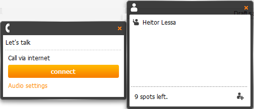
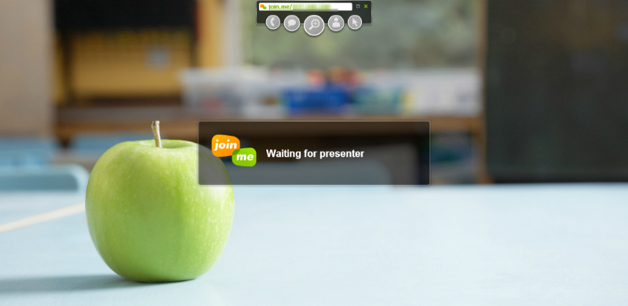

Hi there !

I am delighted to show you guys some useful tools to use in your routine as my first post in this new space.

Sometimes we we need to share screen or even do a remote access to anyone in an easy and safe way. So for this, we have loads of popular tools like [Teamviewer](http://www.teamviewer.com), [LogMeIn](http://logmein.com), [CrossLoop](http://www.crossloop.com), [GoToMyPC](http://www.gotomypc.com)… But, have you ever thought that online tools for web meeting can also be used for this purposes?

One tool that I found today is [Join.Me](http://join.me) — as it says in their video, it’s ridiculously simple. All buttons are very intuitive and you can share a specific application/window rather than your whole Desktop if you want it to.

Besides that, you also have other features as if you were in a meeting (of course their [Pro version](http://help.join.me/knowledgebase/topics/25191-pro-features) is even better) — Another important point is that Join.Me is other app provided by LogMeIn, which means is very secure and easy-to-go!

I also chose that application to teach my students starting the next month, which I already tested in all OS and all with an excellent performance (In Linux x64 Wine had to be used), so follow some screenshots to have an overview =\]

A software will be downloaded (_join.me.exe_) and all you need to do is execute it.

The minimalistic buttons can be moved to anywhere in your screen, and a 9 digits ID is shown on top that will be used for your partner — Grey buttons are Pro features that are disabled (Chat and meeting tools).

VoIP is available to use when a chat must be in place — From my tests, it has the same or even better audio quality of paid alternatives (Cisco WebEx, GoToMeeting, GoToWebinar, etc). It’s crystal clear!

Short link to your visitors if you have a pro license.

That’s it ! You can use this free version up to 10 people (you + 9 viewers), so that would be also useful for a sales online presentation, quick team meeting, online demonstration for a certain amount of guests.

The downside is that you can’t record your meetings/sessions, so you have to use your own tool to do that (SnagIt, Camtasia and ScreenFlow are highly recommended) ; )

It definitely worth trying in a business environment either as it is only €104 a year for up to 250 participants and unlimited hosting sessions.

To finish this post up, follow other tools that I tested today that can also be used for free to a limited number of users:

* [MeetingBurner](https://www.meetingburner.com/) — Another great tool that offers Recording Sessions, however uses Flash so I discarded for my use
* [AnyMeeting](http://anymeeting.com/) — Caught out my attention because it’s free for **UP TO 200 users!** However it uses flash :/

Stay connected for the next IT tip !