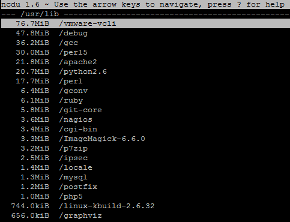
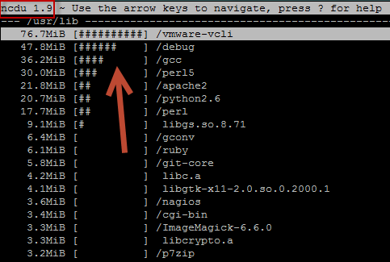

> Have you ever wondered a different way of getting Disk usage stats? Are you tired of using commands like “df -h”, “du -hs”, combining with several other ones in pipe?

What if I tell you that there is an easier way to find out where your free space is going?

> **It’s time to check [NCDU](http://dev.yorhel.nl/ncdu) project out !**

NCDU stands for NCurse Disk Usage which is Linux program that displays Disk usage statistics in a Ncurse menu, which makes things easier where you don’t know exactly where to start — Giving you a good overview and letting you know where is the bottom of disk space issues.

For Windows administrators I highly recommend a tool called [WinDirStat](http://windirstat.info/), which magnificently shows you a beautiful and dynamic coloured picture that points you where are the biggest data in disk.

Back on NCDU, you can quickly install it using your yum (Red Hat distros) or apt-get (Debian distros) as follows:

```bash
apt-get install ncdu  
yum install ncdu
```

NCDU is not available in Red Hat default repo as far as I concern, however you can easily find using [EPEL repository](http://fedoraproject.org/wiki/EPEL).

Let’s get started: Open your shell and run: `ncdu`

This will make NCDU analyses all directories in Linux and will display a simple menu with readable results thereafter. Follow below an example generated by NCDU analyzing a random folder in my VM:



> NOTE: The biggest folder appears on top which facilitates for troubleshooting :)

By default, NCDU 1.6 is installed when you use apt-get/yum, so you can download the [latest version 1.](http://dev.yorhel.nl/download/ncdu-1.9.tar.gz)9 and compile it, hence you will end up having useful options like output results to a file ;)

On saying that, before you start compiling the software you must have curse development libraries which you can get issuing the command below:

```bash
apt-get install libncurses5-dev
yum install ncurses-devel
```

Then, extract the software downloaded and compile it using the default options:

```bash
./configure — prefix=/usr && make && make install
```

Running the NCDU command again you will note a slight change as follow:



By now, you should have new options in NCDU, so we can now scan /usr/lib directories and generate a report to a specified file:

```bash
ncdu /usr/lib -o disk-usage.txt
```

If you have a look at this file you will see that there are loads of information that it may seems complicated to understand at a first glance. But, for your relief this file will be used by NCDU to display that same NCurse menu with all data collected previously.

```bash
ncdu -f disk-usage.txt
```

As a last tip, you can create a crontab to generate reports whenever you wish, compress them in a folder and then whenever suits opening them with ncdu for further analysis. Follow below a script as an excerpt that can be added as a cron job later on:

```bash
#!/bin/bash
#
# This is a simple script that generate compressed NCDU reports based on date_**  
#

# Variables 
DATE=$(date +”%d-%m-%Y”)

nice -n15 ncdu -qxo- / | gzip > /tmp/disk\_report-${DATE}.gz
```

Basically this script generates a report of all Linux directories and compress using GZIP command, which generates a file called disk\_report based on actual date. You can use one command line to decompress and view the report as follow:

```bash
zcat /tmp/disk_report-17–04–2013.gz | ncdu -f -
```

A complete manual with examples and some screenshots can be found in the official page: [**Ncdu Manual**](http://dev.yorhel.nl/ncdu/man)

Happy troubleshooting then!