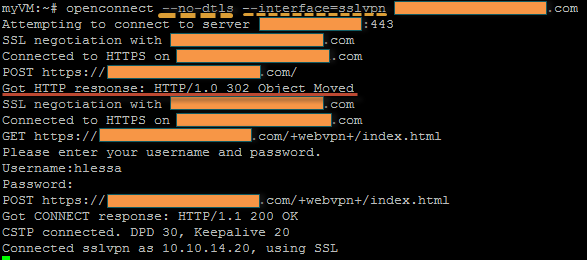
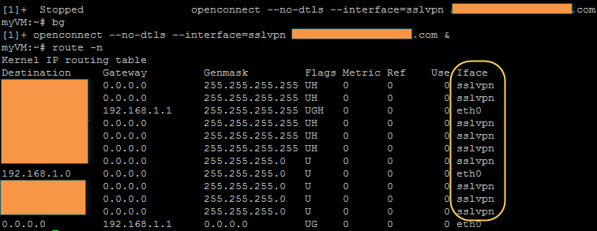

Hi there !

> **Have you ever wondered an easier way to connect to a Cisco SSL VPN using Linux?**

I have been given such task to replace an old OpenVPN to a Cisco one, then I automatically thought that Cisco would provide a great client as well as they offer for Windows…. However the ones that I tried required Graphical Interface (I might be wrong and they might have other ones), so I stopped looking at their website and started a research about opensource alternatives.

Knowing that, I did a bit of a search for CLI alternatives, so I came across to the marvellous software called [openconnect](http://www.infradead.org/openconnect/) which is **not officially** supported by Cisco (same history with [VPNC](http://www.unix-ag.uni-kl.de/~massar/vpnc/)) — But the good news is → Both work flawlessly.

Let’s work then:

Firstly, since version 3.17 we need to **install VPNC** and other dependencies as follow:

```bash
apt-get install zlib1g-dev libxml2-dev openssl libssl-dev pkg-config vpnc
```

> NOTE: if you need support for SecurID and/or TPM, please also install [libstoken](http://stoken.sourceforge.net/) and [trousers](http://trousers.sourceforge.net/).

Secondly, download `openconnect` the latest version (4.99 at this stage), and extract the software to `/usr/local/src`:

```bash
wget -O /tmp/openconnect.tar.gz ftp://ftp.infradead.org/pub/openconnect/openconnect-4.99.tar.gz  
tar -zxvf /tmp/openconnect-4.99.tar.gz -C /usr/local/src
```

Before you compile, ensure that `vpnc-script` binary is under `/etc/vpnc` otherwise you have do define its location manually (e.g ./configure —with-vpnc-script=/your/location).

You can then compile openconnect as shown:

```bash
cd /usr/local/src/openconnect-4.99  
./configure --disable-nls  
make  
make install
```

Confirm if everything ran smoothly: `which openconnect` - You should see **/usr/local/sbin/openconnect** as output.

From this article, I will be showing a connection using username/password only, but if you also need cert, DTLS or SecurID you can refer to [openconnect manual page](http://www.infradead.org/openconnect/manual.html).

Please find below a sample connecting to one Cisco AnyConnect:



Here we used `—no-dtls` option as it caused random problems with some Linux, so I decided to disable (feel free to test yourself). I also used `interface=sslvpn` option for openconnect create a interface called `sslvpn` rather than `tun0`, `tun1`, etc — it makes things easier when you must connect to multiple VPNs.

Basically, `openconnect` took the following steps to connect:

* Confirmed if SSL certificate installed in Cisco ASA was valid — It will display a warning otherwise
* Handled HTTP redirect correctly
* Identified HTTP forms in Cisco AnyConnect page, and then asked for information to fill them out (username And password)
* Once crendetials are right it creates “sslvpn” interface and attributes an IP address as well as DNS — If configured properly in Cisco VPN setup

To confirm that routes were added properly, run in the background (`Ctrl+Z + bg` command), and then issue `route -n` command as shown:



As you can see, loads of routes were added under “sslvpn” interface. Let’s check DNS then:


Note that VPNC overwritten the existent DNS config file according to Cisco VPN policy.

We would not need to put `openconnect` to run in background manually If we provide the option `-b`. But this will be covered in the second part of this article.

So, stay connected for the second part that we will be covering the following parts:

*   How to create a `openconnect` init script
*   How to create a script to monitor such VPN using ICMP, and restart that VPN if it is down

See ya!