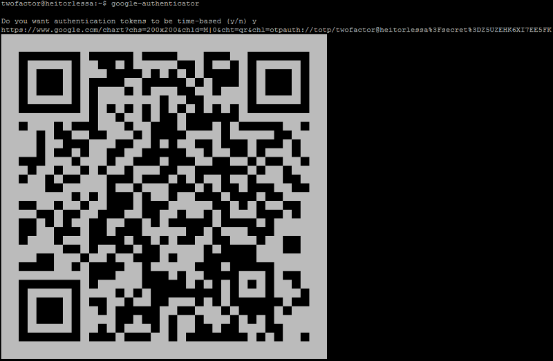
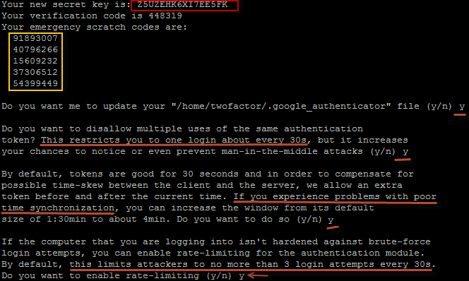
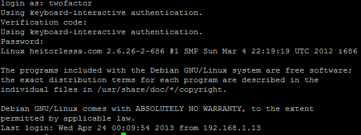
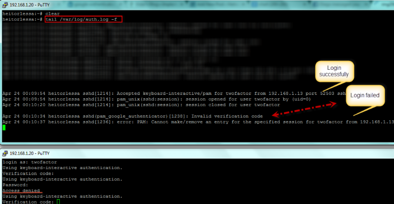
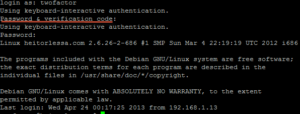

> How to improve **SSH** security using **Two-factor authentication.**

If you are in a process of implementing ISO 27001, PCI-DSS or any other standardization for security, you definitely asked yourself about **SSH Two-factor authentication** or **SSH Dual authentication** as other may say.

There are some software that can accomplish that task, but the most famous one these days is — [Google Authenticator](https://code.google.com/p/google-authenticator/).

Originally the idea was to provide a **TOTP**, Time-based one time password, [for GMail users](https://support.google.com/a/bin/answer.py?hl=en&answer=175197), however they later found that would be ideal to extend that project.

Fortunately, Google ended up creating a **PAM module** that can be install very easily. Even though **Google Authenticator** has to address some risk points, there are some ways to work around and also some projects that work on top of GAuth like [totp-cgi](https://github.com/mricon/totp-cgi).

Here, we will demonstrate how to install GAuth in Debian and give some other references that may be useful for you guys.

> **Let’s work then!**

Open up your shell, install GIT (if you don’t have), install **GAuth dependencies** and then checkout GAuth repo as follows:

```bash
apt-get install git  
apt-get install libqrencode3 libpam0g-dev  
cd /usr/local/src && git clone https://code.google.com/p/google-authenticator
```

Git will create a folder called `google-authenticator`, hence step into that folder, go to libpam directory and run a make install:

```bash
cd google-authenticator  
make install
```

This will generate GAuth module and binaries in the current folder, and then the file **pam_google_authenticator.so** will be copied to **/lib/security** folder as well as GAuth binary will be copied to /usr/local/bin/.

For learning purposes, we will be creating a user called `twofactor` and run `google-authenticator` command to set up our environment:

```bash
useradd -m -s /bin/bash twofactor && passwd twofactor  
su - twofactor  
google-authenticator
```

Answer yes to the first question and you should see a screen like this:



If you install those dependencies correctly, you should see the **QR Code** that can be scanned using **Google Authenticator** for your mobile phone ([iOS](https://itunes.apple.com/ie/app/google-authenticator/id388497605?mt=8), [Android](https://play.google.com/store/apps/details?id=com.google.android.apps.authenticator2&hl=en), BlackBerry, etc). If you don’t have it, copy the URL above that can be used later on to add to your Mobile App that creates a token.

Google-authenticator will keep asking you a few questions, answer properly as follows:



Follow below a brief explanation about each step:

* Secret key that will be used to set up your Google Authentication Mobile app in case you don’t have your QR Code
* Emergency scratch codes are given to be used in case you lost your phone, so you can use one of them once until you reconfigure your virtual token again
* The first question asks to create the file .google_authenticator in your home and updates within information given
* The second question asks if you want to allow multiple logins in a row, which means that if you are a putty lover that uses “Duplicate session” all the time, enabling that option you will have to wait 30s to create a new one ;) (Not the end of the world anyway)
* There is a known issue that even though you have server/client clock synchronized sometimes you may get an error (invalid verification code), so say Yes to that question anyway just in case
* Last question is about brute force prevention, that can also be solved using softwares like [fail2ban](http://www.fail2ban.org/wiki/index.php/Main_Page) or [OSSEC](http://www.ossec.net/)

With all these already adjusted, we have to move on configuring PAM module and SSH respectively, so all you have to do is add a new line in PAM configuration file **/etc/pam.d/sshd** as first line as follow:

```bash
# Google authenticator module for SSH  
auth required pam_google_authenticator.so nullok
```

The parameter `nullok` guarantees that Verification code will not be asked for users who don’t have GAuth configured. Then, change the line below as follow in your SSH server configuration file `/etc/ssh/sshd_config`:

```bash
ChallengeResponseAuthentication yes
```

Restart your SSH and let’s do a test connecting as twofactor user: `/etc/init.d/ssh restart`



**Behind the scenes**



As shown in the first picture, before asking the password it asks you the Verification code and if everything went well you should be able to get the login shell. However, if the Verification code fails (e.g invalid verification code) you will get an access denied and a new log entry will be also created in /var/log/auth file as shown in the second picture.

#### Extras

If you also want to enable Google Authenticator for Gnome, add exactly the same line to the files: 

* `/etc/pam.d/gdm`
* `/etc/pam.d/gnome-screensaver`

If you want the scheme password+verification code (which is safer IMHO), you can use the line below in your `/etc/pam.d/sshd`

```bash
auth required pam_google_authenticator.so nullok forward_pass
```

#### Result



Public key authentication does not work with Google Authenticator as it is interpreted as a different authentication for SSH (PubKey Auth and Password Auth), however there are projects that you may find useful:

* [Duo Unix - Two-Factor Authentication for SSH with PAM Support (pam_duo)](https://www.duosecurity.com/docs/duounix)
* [Chapter 5. Authentication and Interoperability](https://access.redhat.com/site/documentation/en-US/Red_Hat_Enterprise_Linux/6/html/6.3_Release_Notes/authentication_interoperability.html)

That’s all folks!

As soon as I get some time I will also publish another one how to use Google Authenticator with Apache ;)

Thanks and see you!