> How to create a **Site-to-site VPN** between **pfSense** and **Amazon VPC using **Virtual Private Gateway** feature.

From here, I presume that you already know what is [pfSense**](http://www.pfsense.org) and [Amazon VPC](http://aws.amazon.com/vpc/), however instead of creating an instance in **Amazon** and use an **IPsec** software, we will be using here a VPN Gateway in Amazon that can be created quite easily.

Basically, we will be setting up an **IPsec VPN** using **IKEv1** because IKEv2 its not supported by Amazon (learnt in the hardest way unfortunately), and this tunnel will share static routes. Follow below an image I created specifically for this article that will help you to have a better overview:

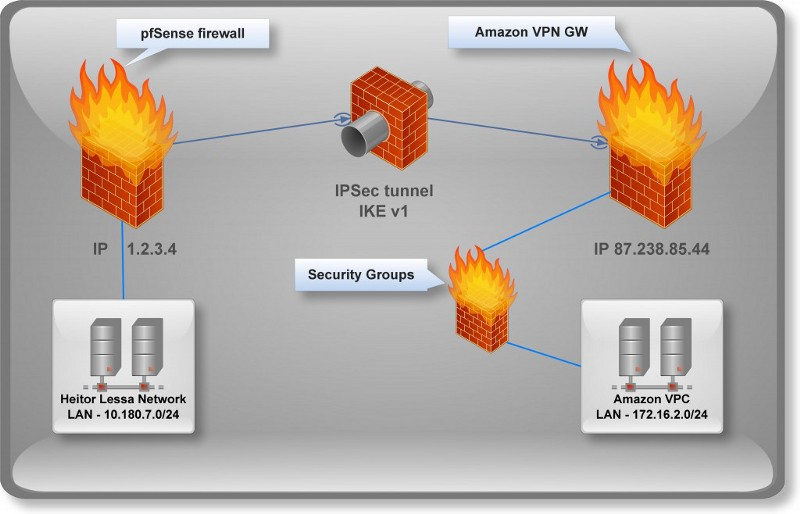

I would say this is quite straightforward, however if you are looking for a **VPN** using **BGP** protocol with **pfSense** [check out this well written article](http://www.seattleit.net/blog/pfsense-ipsec-vpn-gateway-amazon-vpc-bgp-routing/).

Starting from scratch, we will need to create a **VPG in Amazon** as below:

Go to your Amazon VPC dashboard and select the button **Add a VPN connection**

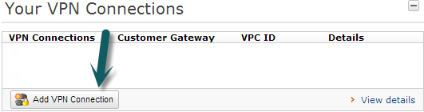

A new window will show up to fill out the a form as follow:

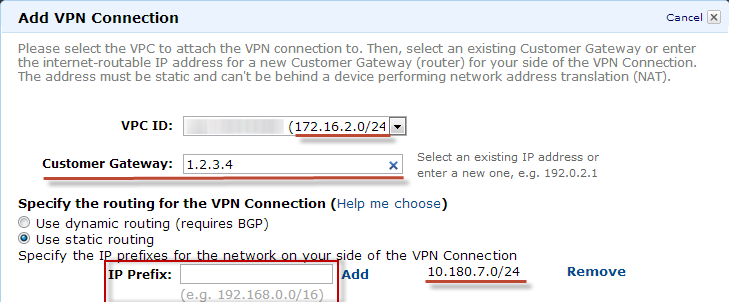

As you see, you firstly have to choose your VPC subnet (172.16.2.0/24 in this case), then **your external IP** in Customer Gateway, your LAN subnet (10.180.7.0/24) in **IP Prefix** and finally select **Add/Yes create** to finish the **VPN creation**.

It will take few minutes to create the **VPN gateway** in Amazon and you should see the image below until complete.

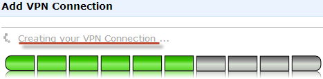

Once completed, go to **VPN Connection** option in the left-side menu as shown:

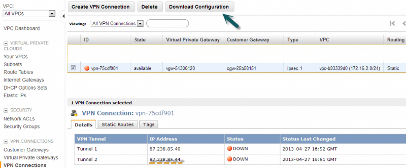

Note we have a button on top “Download configuration” and we also have two Tunnels, however Amazon does not offer a configuration file for pfSense. But the Phase1 and Phase2 settings will be default (until they change of course) for all **VPN**s created in **VPC, apart of course the password and IPs.

Also, we will be using the second tunnel as I had so much trouble (connection dropped very often) using the first one.

Download any configuration (we will be using Fortinet as an example) and get the password from there:

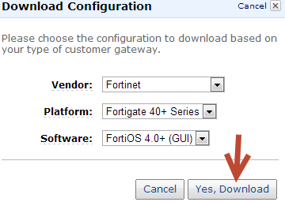

Open the text file downloaded previously and look for the **Pre-Shared key** in the **second peer** as shown below:

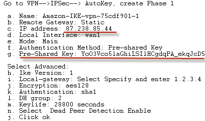

### pfSense configuration

Open up your **pfSense** dashboard and go to **VPN** → **IPsec**:

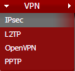

Then add a new Phase1 entry (clicking on button +) and fill out the **Phase1** as follows:

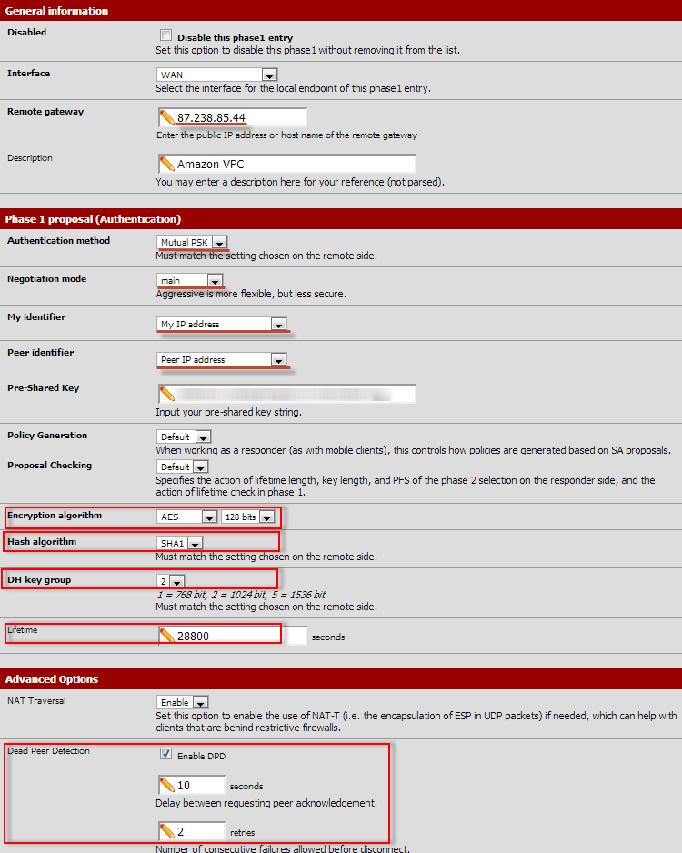

Once saved, expand the VPN configuration clicking in “+” and then create a new Phase2 entry as follows:

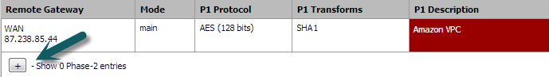

Fill out the form as follows:

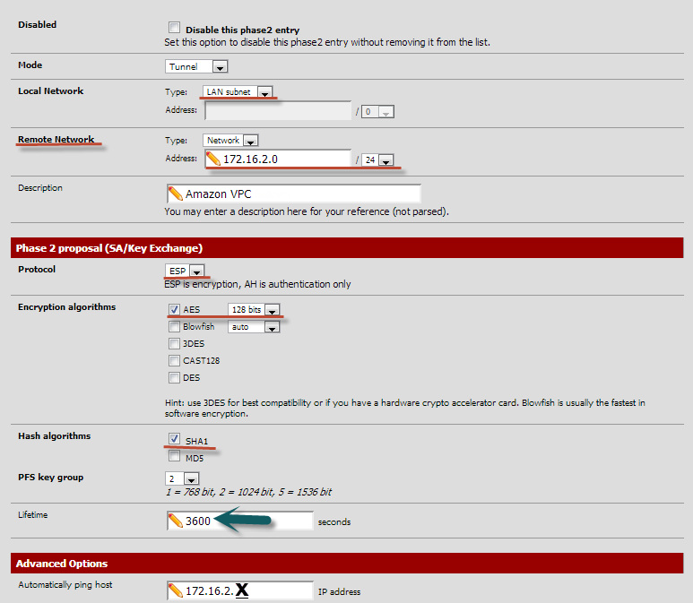

It’s pretty much the same phase1 concerning Encryption and Hash algorithm, however note that we **Lifetime** has changed here**,** because all configuration must match in both sides (that’s the way IPsec works).

Note in the last field “Automatically ping host” we have defined a 172.16.2.X which should be replaced to any host you have in Amazon, this keeps the tunnel UP and also brings the tunnel UP if there is any traffic.

Save and apply the changes in pfSense. By now, we have to configure a firewall rule under IPsec interface to allow traffic going through both ends. So, go to firewall -> Rules and then select IPsec interface there.

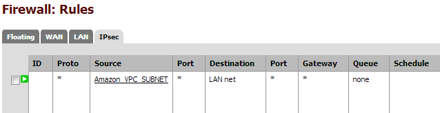

Basically, all you need to do is create a firewall rule allowing traffic from Amazon VPC Subnet (172.16.2.0/24) to your LAN subnet (10.180.7.0/24 in this case).

#### Amazon side

Briefly, we need to add a route to all our instances in that specific VPC subnet (172.16.2.0/24) and create a new rule in Security Group allowing traffic from our network.

Starting with routes, go to “Route tables” in the left-side menu, select **your subnet** (172.16.2.0/24 in this case), choose “Route propagation” option at the bottom, and then select your Virtual Private Gateway recently created. This will automatically create a route to your network in all instances that are in such subnet — It may take few minutes to propagate to all your instances.

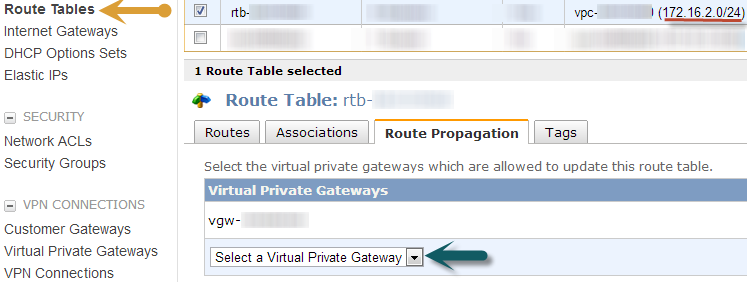

Choose then “Routes” option to see if your route was added correctly:

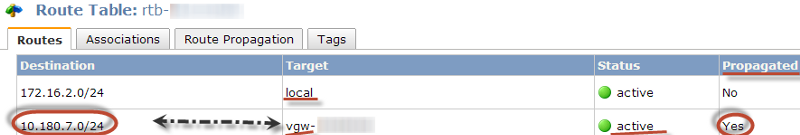

Note that we have two routes and two targets (Local|VGW), so we can confirm that our route was propagated to all instances in that VPC (Propagated = yes).

As a last thing, **don’t forget** to update your Security Groups to allow traffic from your network ;)

#### Results

Check the VPN status on pfSense going to Status → IPsec, if not connected you can do a ping from your machine to any machine in Amazon forcing any sort of traffic through the VPN:

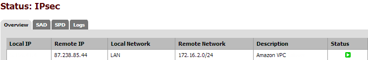
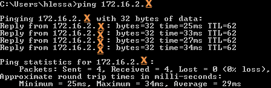

In case your VPN is still down, look into IPsec logs (Status → Logs → IPsec) and look for error there — They are always very helpful. But even though you could not figure out by yourself, feel free to post a comment here and I would be grateful to help.

**PS: If you are experiencing some packet fragmentation, consider tuning your MTU/MSS accordingly.**

Stay connected to the next tip if you use SFTP.