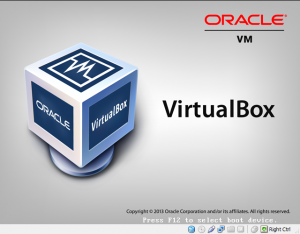

> **Looking for Virtual machine images for Virtualbox and/or VMware? That quick tip is for you then.**

Sometimes you need to build a dev environment or even a quick one for learning purposes. However, you are always in a hurry and can’t spend time installing a new Linux distribution or configuring basic settings in a specific software.

So, sites like these below come in place and they are our tip of the day:

#### VirtualBox Virtual machine images

* [http://virtualboxes.org/images/](http://virtualboxes.org/images/) — I found this one very useful, specially when you are just looking for Linux distributions with basic packages.
* [http://virtualboximages.com/](http://virtualboximages.com/) — This website is quite famous for delivering and you most probably find the latest releases, and also you will find some customized images with softwares included like SugarCRM, Drupal, etc. The drawback here is that you may find several paid images.

#### VMware Virtual machine images

* [VMware appliances store](https://solutionexchange.vmware.com/store/category_groups/19) — That’s the main place for **virtual machine images** and I start using since 2009 — Very useful indeed, great variety and updated ones.
* [Basic virtual machines](http://www.thoughtpolice.co.uk/vmware/) — This one is very similar to VirtualBoxes website as they provide purely default installation based, and the greatest thing here is that their torrent speed is brilliant (Usually get 1MB/s).

#### UPDATE 02/05

As per last comment, I forgot to include other websites that offer VMs with softwares pre-configured (like Wordpress, Joomla, RedMine, etc):

* [TurnKey](http://www.turnkeylinux.org/)
* [BitNami](http://bitnami.com/)

They are quite similar and offer a wide variety of pre-configured VMs, but TurnKey offers a magnificant Cloud backup service (paid) that I had to use in a customer months ago. So, if you have any suggestion that I can include — Please, leave a comment ;)

That was a quick tip and hope you find your image there and save up some time for other things :)