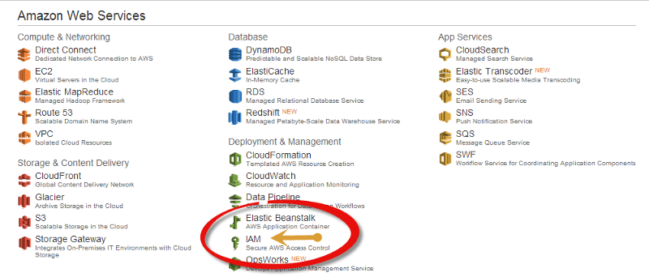
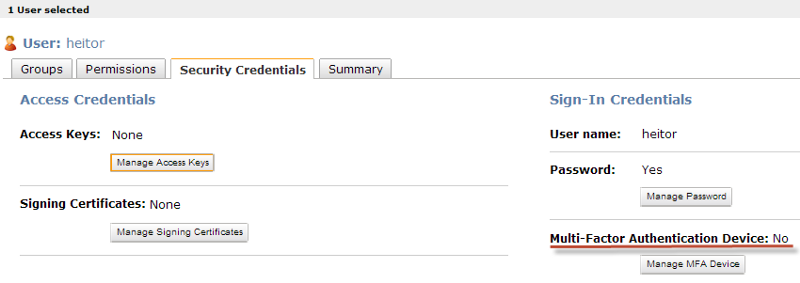
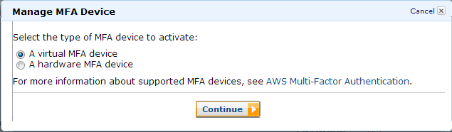
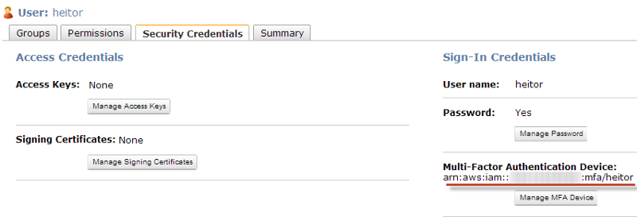
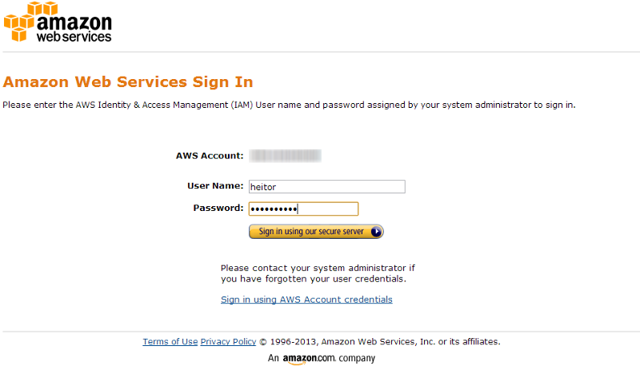
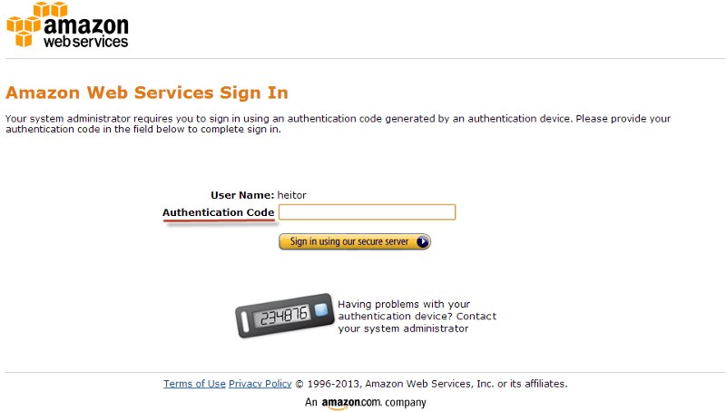

Doing some experiments with **Google Authenticator** I also found that can be used with **Amazon AWS**, which can bring **an additional security** to all employees that need access to your Cloud.

So, as Amazon offers a wide range of services, most of us sometimes pass by unnoticed that there is **Amazon IAM** (AWS Identity and Access Management) feature, which helps managing any sort of access into the cloud.

From here, we assume that you already have your Amazon account, your users and services already created. Then, all you need to do is to open your **AWS Console**:

As outlined in the image above, select IAM feature and you should get the IAM Dashboard:

![**AWS Two-factor authentication** — IAM dashboard[caption]](img/1__FKnIc9L1HyLbBAy__BflNog.png)

Rather than insert the whole IAM Dashboard screenshot, you should pay attention in that specific part that can be found at the bottom of the page. At this stage, you should copy that link that will be used to sign in when you have **Google authenticator** activated.

Go to **Users** and select your one (heitor in this case here), and then select the tab **“Security Credentials”** as follows:

Note that Multi-Factor Authentication Device (MFA) is not enabled by default, so click in **“Manage MFA device”:**

Keep the first option selected and click in Continue, and then Continue again:

From now, all you need to do is open up your Google Authentication Mobile App and scan the QR Code, then you will be able to generate code as a virtual token, and then input the first code and wait until you get the second code to also include in the form. Once completed, click in **Activate Virtual MFA.**

If everything went well that popup window will be automatically closed and you must see the information below:

#### Results

Let’s go to our tests. Access the URL you got at the beginning which now should look like this:

Once you type your password, you must be redirected to a second page prompting for your Google Authenticator code:

And That’s It ! Easy breeze :)

Leave a comment if you have any feedback, doubts or suggestions!