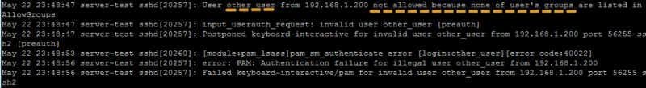

You may find loads of articles how to do a SFTP using SSH as well as a Jail, however only few websites provide a How To authenticate against an existent Active Directory. Moreover, you may find hard using winbind to join your Linux into the Windows domain, so this article here shows how to do the same thing in a simple manner.

Basically what you are going to need is:

* **Active Directory** already installed and configured properly
* A Linux box with **SSH server** installed
* A group that will contain authorized members to access our **SFTP**

You may ask what’s the usage in a real world of this… I would say that you can use this How-To for:

* Creating a **secure way to transfer files** to a Linux Box using **SFTP protocol**
* Creating a secure and integrated way to use your existent authentication service (e.g AD) to offer a SFTP to customers, which they can **upload files to an Application server and make them private**, and if also needed you can offer a public folder that all users can share information

In case you have any doubt or any suggestions, please leave a comment :)

#### Joining Linux into AD domain

To start, open up a connection to your Linux Box via SSH and install **likewise** software: `apt-get install likewise-open`


Before you go ahead with our first task, please ensure your **Linux box can reach your domain** (hint: check your DNS settings).

Basically as our first task, we need to **join the domain** with the command below and then **restart your Linux box**: `domainjoin-cli join yourADdomain Administrator_account`


Most of the articles out there will stop here and will not configure some security, so from here we will be tweaking **likewise-open** configuration in relation to AD accounts — Issue the commands below:

* If you have only **one domain** and you **don’t want to login as DOMAINusername**, run `lwconfig AssumeDefaultDomain true`

* As we don’t want that any AD accounts log in to our SFTP box, execute the following commands to remove their shell:

```bash
lwconfig LoginShellTemplate "/bin/false"  
lwconfig Local\_SkeletonDirs ""
```

* From here, we are going to change their Home Dir to a folder called “/upload” that we will be creating later on:

```bash
lwconfig HomeDirPrefix "/upload"  
lwconfig HomeDirTemplate "%H/%U"
```

To ensure that everything was set correctly, you can run the command `lwconfig — dump`:


Once completed, you now should be able to get a list of users and groups respectively by typing the command below:

```bash
getent passwd  
getent group
```

Note that all users retrieved now look like local ones.


### SSH Setup

Make a copy of your SSH server configuration file, and then make the following outlined changes:


Comment that line that will be replaced for that new one in the yellow circle

* **UsePAM** parameter must be outside of yellow group (preferably above)

In the yellow circle we have a couple of options that we have to pay attention as:

* **Match Group** — If the SFTP user is a member of sftp group, all rules below will be automatically applied — such user will be consequently jailed.
* **ChrootDirectory** — This parameter define which directory such user should be locked. That means that once defined the directory, this user cannot browse any previous folder — in this case will be changed to /upload.

To restrict even more, we can now define which group will be allowed to access our SSH adding a new option on /etc/ssh/sshd\_config:


From here, we are allowing members of the group adm, sftp and unix\_admins, and by now all we need to do is restart SSH service to apply all changes made so far.

#### Jail configuration

Once you get **SSH and Domain configuration** done, we need to play with permissions in Linux. As the first requirement, Jail folder (**Chroot Directory**) must be owned by root — then run the command below to get this sorted:

mkdir –p /upload && chmod 755 /upload && chown root.root /upload

Hence, our public folder must be created and the correct permission should be granted to allow all privileges to any user:

mkdir –p /upload/public && chmod 777 –R /upload/public

For each user that will be added we have to create its folder and then **apply the right permissions**, so in order to facilitate this process we created a **simple script** that can do this as follows:


**UPDATE: I no longer have this script but it’s as simple as querying AD, create a new folder and apply permissions**

Briefly, the script checks against AD (using getent passwd command) to see if the user exists, and then create its folder under /upload, and finally apply the restrictive permissions.

#### SFTP Results

Testing with the user above (hlessa), we will be trying to connect to the SFTP in question and see the SSH logs behaviour:




This way, newer users can have their own folder and access a public one where documents can be shared with other users, but users that are not in the group defined previously (adm, sftp, unix\_admins) will have their access denied as shown in the last picture.