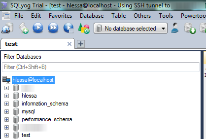

Continuing articles about Two-Factor **authentication** or integrating Linux services with **Active Directory,** this How-To is one of my recent works that I have done these days, so I hope it may help the community with this guide to configure **MySQL with PAM** and subsequently using **Active Directory** to authenticate. If you are new here, please refer to **SSH Two-Factor authentication**, which explains how to install likewise and integrate your Linux with AD. However, we will have few exceptions to get **MySQL** working with **PAM authentication.**

Before you continue, please make sure that you have **MySQL 5.5.16 or a newer version**, otherwise it can generates some conflicts and unnecessary headaches. Also, ensure that you have very well designed a secure environment to access your database wherever be the location, a **VPN** or [SSL](http://www.mysqlfanboy.com/2011/11/simplified-mysql-ssl-connections/) is always a **requirement** to go forward to the next step in this article as passwords are sent in clear-text (**auth_pam_compat)** at some stage.

#### Installing percona-pam-authentication

Let’s begin! Download and install bzr to get **percona-pam-authentication** plugin source code:

```bash
apt-get install bzr -y  
cd /usr/local/src  
bzr branch lp:percona-pam-for-mysql
```

A folder **percona-pam-for-mysql** will be created containing the source code, but before we start **compiling and installing it,** we have to install the minimum requirements: `apt-get install libpam0g-dev libmysqlclient-dev dh-autoreconf`

Now go to your folder recently created (percona-pam-for-mysql..) and let’s compile:

```bash
./bootstrap  
./configure --with-mysql_config=$(which mysql_config)  
make  
make install
```

Confirm if the lib was installed under MySQL plugins directory, however if you are unsure where it is run the command below:

```bash
mysql_config --plugindir  
ls /usr/lib/mysql/plugin | grep pam
```

If you got stuck or got any error while doing any of the steps above, please leave a comment and I will help you to go through with this. However, if everything went fine as it should be, it’s time to load percona plugin into MySQL executing the command below on **mysql shell as root**:

```bash
INSTALL PLUGIN auth_pam SONAME 'auth_pam.so';  
INSTALL PLUGIN auth_pam_compat SONAME 'auth_pam_compat.so';
```

Ensure then that these plugins were loaded correctly and are active: `SHOW PLUGINS;`


#### Configuring MySQL PAM authentication

Once percona module is installed, PAM must be configured and personally I’d say it is really straightforward apart of one tricky mentioned later on. Therefore, create a file named **mysqld** under **/etc/pam.d** containing the following contents:

```bash
# Standard Unix authentication.  
@include common-auth
```

The tricky here is to add **mysql user** in the **shadow group** as MySQL will need to read shadow passwd file, however some people for some unknown reason advise to run MySQL as root to get this sorted, but all we need here is only read the shadow file , and shadow group has already read access — so, there’s no need to reinvent the wheel.

```bash
adduser mysql shadow
```

Restart MySQL to apply the new changes. Hence, we need to apply a grant to my user “hlessa” (created in AD previously for older articles) to connect to the database:

```bash
CREATE USER 'hlessa'@'localhost' IDENTIFIED WITH auth_pam;  
CREATE USER 'hlessa'@'192.168.1.10' IDENTIFIED WITH auth_pam_compat;
```

Before we go further, we need to understand **what’s the difference** between **auth_pam** and **auth_pam_compat**:

* **Auth_pam** — As its own documentation explains, this is the module that implement Full Support to PAM authentication, and also uses dialog.so which is the preferred method to use here, **however if you need to use a SQL Client to connect to your MySQL from Windows, this module here will fail**;
* **Auth_pam_compat** — This module is a Oracle-compatible one that uses **mysql_clear_password,** which has to be used only if the method above does not work, however this one is totally functional with Windows SQL clients (e.g dbForge Studio from Devart).

That said, we also need to remember that while connecting to your MySQL database using your AD username, such password will be sent in clear text, so it is more than a **requirement** having [MySQL SSL enabled](http://www.mysqlfanboy.com/2011/11/simplified-mysql-ssl-connections/)**, a [SSH tunnel](http://chxo.com/be2/20040511_5667.html), or a VPN** in place for security reasons.

Another important point is that **once you defined a grant using auth_pam for a hostname** (localhost or 192.168.1.10 for example), you cannot use both plugins to authenticate, but revoking the current grant and applying the new one (e.g changing from auth_pam to auth_pam_compat).

#### Results

As most of the people will try to connect to their MySQL databases using a SQL client, I will be showing here tests using two of the most famous softwares for this purposes:

* [**SQLyog**](https://www.webyog.com/) — The latest version **does not have support to mysql_clear_password**, however I contacted them and they offered a non-released version that can be found [here for x64 systems](http://www.webyog.com/downloads/betas/not_released/SQLyog-11.1.1-1.x64.exe) and [here for x86 ones.](http://www.webyog.com/downloads/betas/not_released/SQLyog-11.1.1-1.x86.exe)



* [**DB Forge Studio for MySQL**](http://www.devart.com/dbforge/mysql/studio/) — I’d rather go with this software as `mysql_clear_password` is supported in their latest release:


As you can see above, it is also possible to apply grants to an AD user which works fine as we are using **likewise** and **PAM authentication,** so there’s no difference in syntax of applying grants however it does have when you create the user firstly as mentioned earlier on.

Example of grant:

```bash
GRANT ALL PRIVILEGES ON *.* TO ‘hlessa’@’localhost’;
```

As a result, I showed to you that it is possible to use a MySQL free version and install percona PAM plugin to connect to your MySQL database with your existent AD or Linux users. It also has the possibility to keep using SSH tunnel or remote connection to connect to MySQL, and also that grants are fully compatible with this plugin.

If you have any issues or feedback, please comments are always welcomed.

**UPDATE 02/07 — Included dh-autoreconf package as per comments below, Christian ran into some issues and I may have that installed previously.**