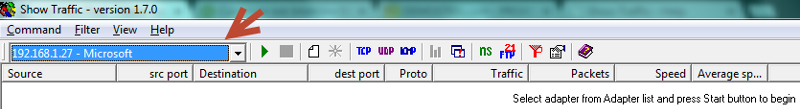
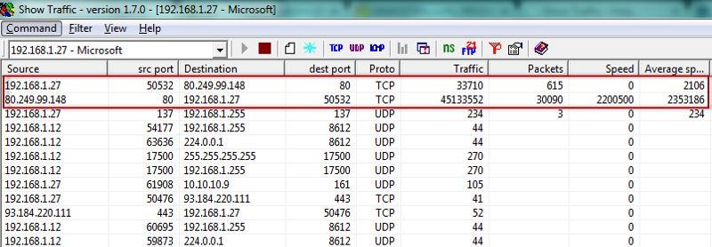
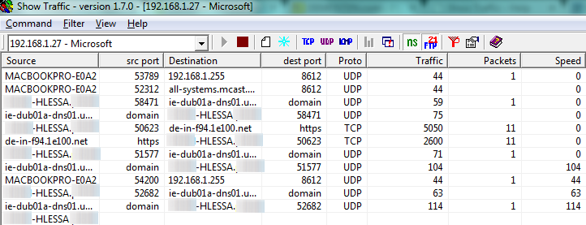

We have a wide range of softwares for troubleshooting in Linux ie built-in or not, however when it comes to **Windows** environment you can mostly find sharewares and only few freewares that really do the job. So, we will be showing in this quick tip an application called [Show Traffic](http://demosten.com/showtraf/) which is old (2008) but gold, and can save you from some headaches.

**Keep in mind that we are here referring to a bottleneck in a specific system where there is a high network traffic coming from/to. For a deeper network bottleneck analysis, please use proper Monitoring tools for this scenario.**

To get started, go to the [download link here](http://sourceforge.net/projects/showtraf/) and install in few steps. However, for those interested in getting the source code as it is an Open Source project — please find [here](http://prdownloads.sourceforge.net/showtraf/showtraf-1.7.0-src-noWDPack.zip?download).

Open up the software and choose your interface that will be put in promiscuous mode to capture all packets:

Click on the Start button and in few seconds you should see the **network activity** as shown:

As we can see above, there’s a big difference between the **packets/traffic** on top with the others one below, so we can quickly find a **network bottleneck** here. As a result, we conclude that there is a connection to a specific IP using port 80 (HTTP), and the **bottleneck** is on download link (second line).

For those who prefer to resolve names and TCP ports to a known protocol, please use the options below:

That’s it ! It’s a really quick tip that you may find useful on a daily basis.

Of course, we can also use several other tools to do the same work, but I personally believe that this is by far the easiest and quickest way to find a n**etwork bottleneck like this**, and I also used several times this tool to find worms together with [port scanners](http://nmap.org/book/inst-windows.html) + [wireshark](http://www.wireshark.org/).

Hope that helps!