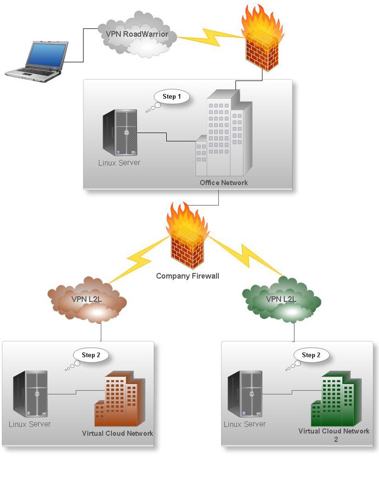
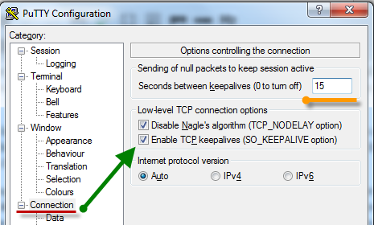
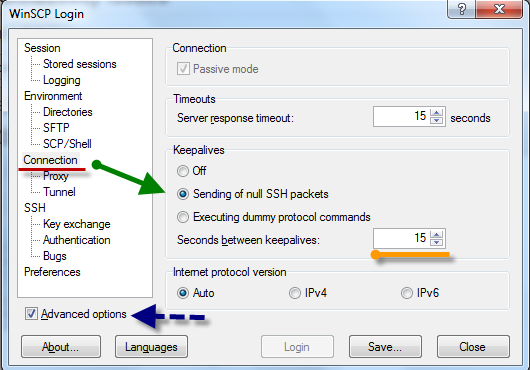

When working with Cloud environments you find yourself connected with 1 or sometimes 2, 3 VPNs to get a simple shell, and when you are there you may get stuck and confused why your **connection keeps dropping** every time you simply run a **TOP, HTOP** or any other command that generates a good amount of output to the screen.

The reason why is that when you are connected through tunnels, and you have to jump into few places until you get there, you may end having packet fragmentation and TCP retransmission, resulting in timeouts, etc. Therefore, please find the image below to illustrate better this idea that we are going to use for our troubleshooting.

This is a real scenario that you may find familiar to yours, so from here we have an example of someone that is **connected to a** **Client-To-Site VPN**, and then **access a Linux server in the office normally** (without any problems at all).

However, that exactly the same company also **has a Site-To-Site VPN to other 2 Cloud environments** or could even be customers, and consequently having access to those servers outlined above.

Having that said, we will be using this environment to highlight a **common problem** that happen.

In this case our user is trying to connect to a **Linux Server via SSH on our first Virtual Cloud Network**, so he has to connect to our **company VPN first**, and then **he can get there through the company**. So far so good, we can simply connect without almost any delay, **browse folders and do basic stuff like create files, remove, etc**. However, when we try to run **top command** **we run into an issue** that our shell simply freezes and it takes a while to time out, so we have to reconnect to that same Linux box without any problems.

In order to rule out even more, we can confirm that **company users have no problem to connect to other servers located in the cloud or in customer sites.**

On saying that, we have three important facts:

*   **We can connect to the VPN normally and access any servers in any part of this diagram**
*   **However our connection gets unstable in any Linux server when we have to go through our Company network via VPN, and then going to other ones in the cloud.**
*   **But, company users have no issues when connecting to these same servers.**

With that in mind, we could quickly run a test in one of the servers in our Cloud Network using the command below:

ifconfig eth0 mtu 578

Assuming that **eth0** is the interface which we are trying to connect, we are lowering MTU directly in our Linux on the main interface, so please retry connecting to this server and run **top** once again, and then if that works we now know where the problem is.

Most system administrators usually go lowering MTU on individual hosts that may present the problem — **PLEASE, don’t do it as it will fix but not solve the problem.**

So, from here I can certainly say that there is an issue of the MTU assigned to the VPN user when connecting to the company. That being said, I will use an example of a **Cisco AnyConnect** but it could easily be any other like Fortigate, Shrew Client, etc. which is the firewall or the VPN concentrator responsible to provide the VPN Client-To-Site feature.

Hence, we need to [find out that what is the right MTU](http://www.dslreports.com/faq/695) to adjust our VPN settings, however I won’t give the steps to do so as there are plenty of information out there, and even if I do there would be some people interested in copying and paste only.

Once found, you can **test** first with your PC, so if you are using Windows you can change your MTU temporarily using [**netsh tool**](http://www.richard-slater.co.uk/archives/2009/10/23/change-your-mtu-under-vista-windows-7-or-windows-8/), and then when you discover the best MTU to use you can make this change permanently in your VPN/Firewall appliance (Using Cisco ASA, you can go to Remote VPN and then under Cisco AnyConnect you can define a MTU to all VPN users based on Profile settings).

Other issues that you may come across is having your SSH connection dropping after a while (in these cases, it does not really matter where you are connecting from), this issue is related to KeepAlive setting, but most of the time people go to SSH Server configuration and find that option Enabled but keep getting their sessions disconnected.

Fortunately there is still a hope, even though you defined ClientInterval and other settings for SSH Client in your server, you may have forgot that your **Putty client does not enable KeepAlive by default**, so go right there and configure it to solve this problem — **This solution also applies to WinSCP that keep disconnecting after a while**. There are other cases that even though KeepAlive is enabled with Putty, **you also need to reduce the Seconds Interval that your client will send null packets to keep such session alive**.

Either issues you run into, always remember that you can run a sniffer (don’t be afraid of him, he’s your best friend) to find out where exactly is the bottom of this problem, and then you can finally solve it and save some time and headaches doing some trial and errors — That’s why theory is so important to learn rather than copying and paste stuff we see out there.t