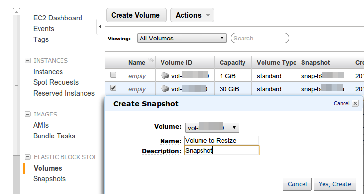
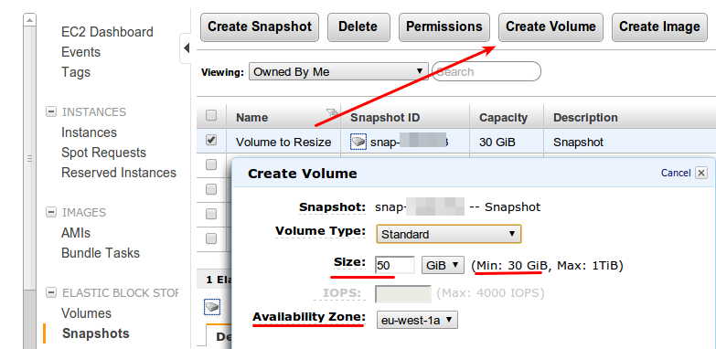
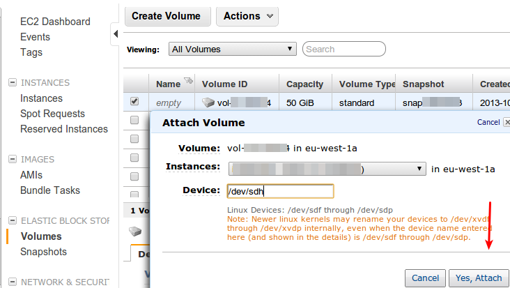
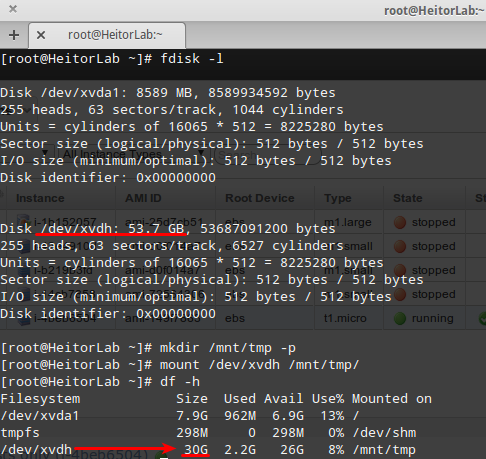
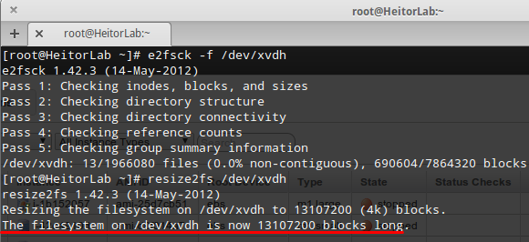
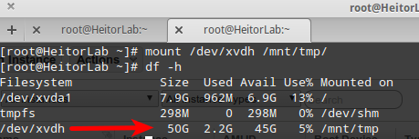
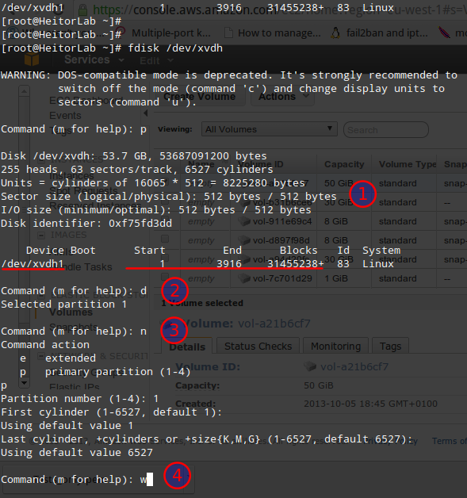
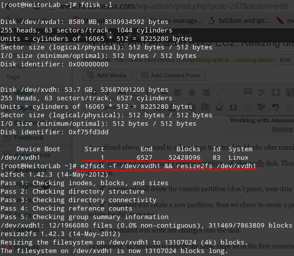

> Have you ever thought how easy would be to resize a disk in a Cloud environment?

**Now, imagine with AWS… much easier though :)**

Starting a new article series called “**Working with Amazon AWS**” after thinking a lot if this would be public or private classes, I’ve decided to make it public through this website and in a future opportunity write a proper course about Cloud tricks, etc. So, from now on, you will be expected to see some quick/detailed articles about a service or a trick that will make your life easier and save yourself some time up.

Our first one will be **resizing EBS volumes in Linux** in few easy steps that can apply to any Linux distribution as well as some tips for similar scenarios that you may find.

> NOTE: If someone need that for Windows, please leave a comment and I will write one

Firstly, I presume that you know what **EBS** is and other terminologies used in an **AWS** environment, however if you do not feel comfortable to proceed, please check EBS docs to get started as well as refine your existent knowledge: [Amazon AWS EC2 documentation](http://aws.amazon.com/documentation/ec2/)

Secondly, we will need an instance that is currently running, so we will have the following scenario as an example.

#### Problem

We have a web server up and running perfectly, however we have just got an alert that we are almost running out of space (95% of use). We need to create a new bigger disk and attach to our current server preserving all existing data (including permissions, etc).

#### Solution

As we know, we can dettach/attach resources in Cloud, so our plan is to create a backup (Snapshot), create a new disk based on our Snapshot (new volume), attach to our server and then **resize** it using Linux built-in tools.

So let’s do it !

#### Backup process

By now, we will create a snapshot of our volume that stores all web data via **AWS Console**:

This backup process is fairly simple, all you need to do is select the **volume** you want to **resize**, right click on it and then select “**Create Snapshot**”.

#### New volume process

Once the snapshot is complete, we will be now creating a new volume from this snapshot, however its size will be increased to satisfy our new needs. So, this disk will be increased from **30G to 50G** as follows:

As outlined above in the image, please note that “Min” is the current size of our old disk, therefore we are **resizing** its value to 50G — Please also ensure that this new volume is in the same AZ (Availability Zone) as your instance, otherwise you won’t be able to attach it later on.

In order to proceed with this new volume, we need to attach to our instance:

Few minutes later we should look at our fdisk output in Linux and find our new disk attached:

As you can see our new volume (sdh) was renamed to /dev/xvdh and it is currently attached perfectly, however while we tried to mount it we are still seeing its old size. From now on, we need to unmount it and resize it — so please read on.

#### Resizing process

This example uses one single disk with no partition which is by far the easiest one, but if you use partitioned the disk please move forward to the next section.

Within the disk unmounted, we will need to resize its file system in order to reflect the new size — so please follow the image below of what we’ve done and explanations about each step later on:

Before resizing the disk, we need to ensure that there are no errors in any aspect of our volume, so the command `e2fsck -f /dev/xvdfh` will do the trick.

Once confirmed it’s all clean, we move on resizing the filesystem using `resize2fs` that also works without any error, which in turn quit leaving the last message to confirm that our filesystem was extended and it is X blocks longer.

You can now mount the disk and confirm that we have a new size and our data was preserved:

Voilá! It’s much easier to do this in a Cloud environment as you have the ability to take Snapshot of your volumes, creating a volume from it and then resizing it using Linux built-in tools.

#### Resizing partitioned disks

In this scenario there’s an additional task, we need to extend disk blocks in our partition in order to resize its filesystem accordingly later on as in the first example. Please find below the image summarizing all steps and its explanation thereafter:

As outlined above, we need to take 4 steps to extend its blocks after running `fdisk /dev/xvdh` as root:

1. “**p**” command will print the current partitions of /dev/xvdh disk. This is highly important as we need to compare disk blocks before we finish this task.
2. “**d**” command will delete the current partition (don’t panic, your data will not be destroyed at this stage).
3. “**n**” command will create a new partition, then we chose to create a primary one with exact the same number (1) and then accept the default values for this scenario.
4. “**w**” command will write our changes into the disk.

To complete, all you need is exactly the same steps as in the first scenario, so in order to summarize please find them below in a single picture:

Please keep in mind that each filesystem might differ using a tool X or Y (i.e XFS, ZFS), but apart from that all process is exactly the same of working in a traditional computing — The main difference here is how easy and brilliantly AWS offers this capability of Snapshot, of course thanks to Virtualization.

If you use LVM, the process is exactly the same of **resizing disk blocks**, PV, VG and finally the LV — so no worries here as well.

Next time we will be talking about Ephemeral Disks (instance storage), which we will be describing different forms of how you could take advantage of this feature that AWS offers for Free — So keep an eye on here!