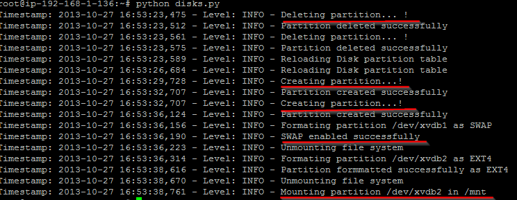

> **Ever wondered how useful instance storage (ephemeral disk) could be?**

As shown in the previously article, we start to see things differently while working with Cloud Computing, therefore apart from the EBS disks we discussed earlier on we will now be focusing in instance storage — well-known as ephemeral disk.

Starting from instances **‘m1.small’** you will notice that an extra storage will be added to your instance, and it will much more noticeable in **‘m1.medium’** and so on — where we will have a really large disk mounted in **‘/mnt’ **— And guess what… **It’s totally free!** You are not charged for using it (reading/writing), so let’s get some more details before our case today.

#### What is ephemeral disk?

Ephemeral disk is a **temporary storage** that it is added to your instance, and depending on your instance type **the bigger is such storage**. Please find a list of storage size available to you in the link below:

[Amazon EC2 Instance Store - Amazon Elastic Compute Cloud](http://docs.aws.amazon.com/AWSEC2/latest/UserGuide/InstanceStorage.html#StorageOnInstanceTypes)

For some instances like **‘c1.medium’** and **‘m1.small’** they use instance storage automatically as **SWAP** as they have a limited amount of memory, while many others are automatically formatted and mounted at ‘/mnt’.

For instance, as they are a temporary storage, you should not rely on these disks to keep long-term data or even other data that you would not like to lose when a failure happens (**i.e stop/start instance, failure on the underlying hardware, terminating instance**), for these purposes please bear in mind that EBS/S3 or any other persistent storage will be your best choice.

Even though the new AWS Console now adds the ephemeral disk for you, it is important to remember that ephemeral disks have to be added by yourself otherwise you will not take advantage of that (i.e you may have an instance running for a long while that don’t even have ephemeral storage, be aware of that), so for more information about command line or even adding ephemerals to AMIs please use the link below:

[Amazon EC2 Instance Store - Amazon Elastic Compute Cloud](http://docs.aws.amazon.com/AWSEC2/latest/UserGuide/InstanceStorage.html#InstanceStore_UsageScenarios)

There are lots of speculations about instances backed with EBS or instance storages regarding performance, costs, etc. So I’d say It depends… Generally speaking, we will have the following points:

* Instance store-backed **is faster** than EBS for the simple fact that it is not persistent
* You **can’t stop your instance** in order to pay less for example, however if you do you will simply lost everything there — So make sure to have backups before doing that
* You **can’t upgrade your instance or scale vertically** (i.e changing instance type), so you will have to create an AMI and from there launch a bigger instance

Of course, there are several workarounds, but truly I say use only when your application is currently **designed to not store anything locally** (i.e S3, NoSQL, etc), and if your application does do this, **make sure you have an EBS volume attached to it**, which in turn will be served for backups or to store sensitive data that can be lost. For a better explanation and examples, I’d suggest you to do a quick read on the following link:

[AMI Types - Amazon Elastic Compute Cloud](http://docs.aws.amazon.com/AWSEC2/latest/UserGuide/ComponentsAMIs.html#storage-for-the-root-device)

#### Use cases

Well, as per descriptions outlined above you will certainly have a fairly idea what you can do/cannot do with ephemeral disks, but it is always good to get some start points of what usually is being done with ephemeral disks, so I will point some of the following that I’ve been doing for a while:

1. Temporary backup
2. Re-format the original instance storage and use part of it for SWAP
3. RAID 10 with 6 disks (4 EBS and 2 Ephemeral disks) to improve instance overall performance and provide HA
4. Application’s cache, logs, any random data

Some people will say that it cannot change the application’s cache or logs from what its suppose to be, so then I commonly ask — **What about symbolic links?**

Other people will say that it’s not a good strategy for backups there, so then I clearly say that you can rethink using **EBS Snapshot + ephemeral storage backups**, because unzipping some data will be much faster sometimes and you don’t have to entirely rely on this backup as this is the quickest option only, but does not mean it is the safest (i.e EBS Snapshots, third-party cloud backup providers, etc).

Few people actually use RAID10 in this scenario, and most of them fail in using because they forget that the more disks you put it does not necessarily mean more performance as EBS disk performance can vary as networking bandwidth is involved — **So the secret behind is to use instances** [EBS-Optimized](http://aws.amazon.com/ec2/#features) **and** [EBS Provisioned IOPS](http://docs.aws.amazon.com/AWSEC2/latest/UserGuide/EBSPerformance.html#consistent_perf) :)

For part of this scenario you can use any programming language to handle these volumes depending on the instance type, and then resize/reformat/remount to better suit to your environment. So, I will be providing a simple python script that can be helpful to:

* Create new disk partitions
* Re-use ephemeral disk as SWAP and mount the rest as /mnt
* Anything else you can do/reinvent :)

#### Result

As there’s a lot to explain about it, I hosted in GitHub in a dedicated repo to this website, so if you are interesting in, please use the following link to download and read the quick manual of how to use it:

[heitorlessa/website](https://github.com/heitorlessa/website)

To finish up, follow the result of this library in action with option ‘force’ enabled:

By now, every time my instance stop/starts my ephemeral disk gets automatically partitioned, formatted, SWAP enabled, mounted as /mnt and a few directories recreated there for my own purposes…

**PS:** Both `ephemeral_disk.py` and `disks.py` can be found in the GitHub repo `website` — Feel free to adapt to your environment ;)  

Next article will be about VPC VPN using Software-based VPN similar to pfSense we will be using OpenSWAN to connect to our instances in VPC — Stay tuned!