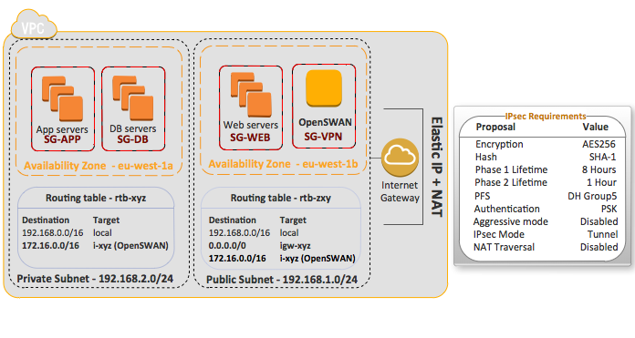
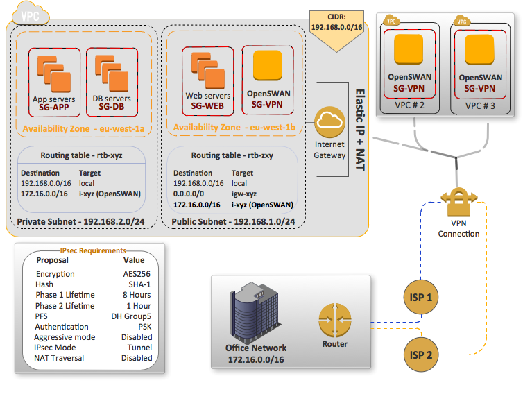

> **Are you looking for a custom encryption algorithm, company requirement for your VPN that is not supported on Hardware VPN in VPC?**

I’ve mostly seen in several networking forums that people don’t set up a Hardware VPN with AWS VPC due to the main reasons below:

* Preference of **using other encryption algorithm** than AES-128 (i.e. AES256, 3DES, etc)
* Company requirement is that PFS (Perfect Forward Secrecy) is disabled (you better off having this enabled for security reasons, anyway)
* **Limitation of 2 Security Association** (1x Inbound, 1x Outbound)
* VPN logs access
* Multiple Tunnels to VPCs but having **limited Public IPs on your side, lack of VRF**, etc
* Need a **different authentication method** — Certificates, for example
* **Must use IKEv2** while VPC Hardware VPN only supports IKEv1
* Requirement to connect each subnet to each ISP you may have (i.e VPC X: subnet 1 -> ISP 1, subnet 2 -> ISP 2)

Fair enough, if you’ve found yourself in that situation and need a **more flexible solution — no need for panic** -, you can still have a VPN between your Office(s) and one or multiple VPCs in the same region or even in different ones.

If you are only looking for **how to interconnect VPCs** **without using Software-VPN**, you will find the [VPC Peering document](http://docs.aws.amazon.com/AmazonVPC/latest/UserGuide/vpc-peering.html) very helpful. I’d also mention that you should be aware of its [limitations](http://docs.aws.amazon.com/AmazonVPC/latest/PeeringGuide/invalid-peering-configurations.html) as there’s no one size fits all.

However, if you are interested in:

* To **interconnect multiple Regions using Software VPN**, you will definitely like this [video](http://www.youtube.com/watch?v=lnyT9FnVKcs)
* To **connect Multiple VPCs using Software VPN** — [check this out](https://aws.amazon.com/articles/5472675506466066)

As **Software-based VPN** also has limitations, keep in mind the following drawbacks before going further:

* **Software encryption/decryption**, so don’t expect performance-wise to be as fast as a Juniper/Cisco doing all this job via Hardware, but it’s also not that bad (newer CPUs have [AES instruction](http://aws.amazon.com/ec2/instance-types/#instance-features)) — Do your tests prior to move to Production
* **Cost-effective**, you know, everything has a cost, so having two or more instances for High Availability will also cost way higher than having AWS VPN Hardware ($0.05 per VPN connection/hourly**)**, which in turn already provides 2 Tunnels for HA.

#### Scenario

In this post, we will be using OpenSWAN which is well-known out there and is very flexible to work with pretty much every known router/firewall (i.e. [Cisco ISR](http://wiki.openwrt.org/doku.php?id=oldwiki:ipsec.openswantocisco851), [Cisco ASA](http://www.thetacticalnuke.com/2012/07/connecting-to-a-cisco-asa-vpn-via-amazon-ec2vpc/), [Fortigate](http://firewallguru.blogspot.ie/2009/08/site-to-site-vpn-openswan-to-fortinet.html), Juniper [ScreenOS](http://www.pedro.kiefer.com.br/2012/10/openswan-tunnel-to-juniper-ssg)/[JunOS](http://web.cs.wpi.edu/~cshue/resources.html), [pfSense](http://web.cs.wpi.edu/~cshue/resources.html), etc). Therefore, let’s assume the following points here before we start install and configure it in an Ubuntu box:

* You already have a Network properly configured on your router/firewall, and knows at least the basic concepts of IPsec
* Your networks don’t Overlap and we don’t need to use NAT-T (NAT 1:1 it’s not a problem, but [PAT](http://ccievault.net/index.php/articles/37-cvnarticles/81-multiple-ipsec-peers-behind-pat)), but if it happens to be — No worries, there’s always a room for help
* You have an existing VPC with at least a [Public Subnet](http://docs.aws.amazon.com/AmazonVPC/latest/UserGuide/VPC_Scenario1.html) where you have an IGW attached to provide internet/Elastic IP

Then, we will need the following information before getting started here, which it will be our reference to configure in both sides:

* **Remote network (Your office, please change it accordingly)** — `192.168.1.0/24`
* **Local network (Your VPC CIDR)** — `172.16.0.0/16`
* **Encryption Algorithm** — `AES 256 key length`
* **Hash Algorithm** — `SHA-1`
* **Perfect Forward Secrecy (PFS)** — `Enabled, Diffie-Hellman (DH) using Group 14 (2048bits)` (I know this is too much, but this is just for POC)
* **Nat Traversal (NAT-T)** — `Disabled`
* **Authentication method** — `Pre-shared-key`
* **IPsec Encapsulation** — `ESP`
* **Firewall to allow** - `Protocol number 50 (ESP), UDP Port 500 (IKE/ISAKMP)`

For a better understanding, I created a diagram showing how it should look like in an existing VPC (i.e focus on public Subnet, OpenSWAN instance and routing tables at this stage only).



> Remember that you don’t need to have these other instances in AWS, they are merely used for illustration purposes

If you were wondering about Multiple VPCs, ISPs, the full diagram below should look more similar to what you currently have:



#### Installing OpenSWAN

Ok, all clear, right? Everything is well defined and we know what we should look at in our devices in order to get this done, so start by connecting to our Ubuntu box (**12.04.3**, it should work in other versions too), and install all libraries and development tools needed to compile OpenSWAN (I know you can do that by simply using apt-get, but it’s better making sure you have the latest version free of bugs.. don’t be lazy!)

Run the following command to be sure you have everything you need to get your hands on OpenSWAN source code:

```bash
sudo -i  
apt-get install build-essential libgmp3-dev, bison, flex -y
```

This should be more than enough to have everything we need to compile OpenSWAN, so let’s finally download OpenSWAN source code and compile it thereafter:

```bash
cd /usr/local/src  
wget --no-check-certificate [https://download.openswan.org/openswan/openswan-latest.tar.gz](https://download.openswan.org/openswan/openswan-latest.tar.gz)  
tar -zxvf openswan-latest.tar.gz
```

Once you have decompressed it ‘cd’ into the folder (i.e. cd openswan-2.X.Y), and then compile it by simply issuing the command: `make programs install`

If you installed all libs properly you should have no problem here, in case you have any issues — feel free to post a comment so I may help you later.

So, if everything worked fine and you have OpenSWAN installed perfectly, run the command below and make sure you have similar results to the following one:

```bash
# ipsec verify

Checking if IPsec got installed and started correctly:

Version check and ipsec on-path [OK]
Openswan U2.6.40/K(no kernel code presently loaded)
See `ipsec –copyright’ for copyright information. 
Checking for IPsec support in kernel [OK] ← If it failed, make sure ‘ipsec’ module is loaded in the kernel (i.e modprobe ipsec)  
Hardware random device check [N/A]  
Checking rp_filter [ENABLED]  
/proc/sys/net/ipv4/conf/all/rp_filter [ENABLED]  
/proc/sys/net/ipv4/conf/default/rp_filter [ENABLED]  
/proc/sys/net/ipv4/conf/lo/rp_filter [ENABLED]  
/proc/sys/net/ipv4/conf/eth0/rp_filter [ENABLED]  
Checking that pluto is running [FAILED] ← this is mainly if service is running  
Checking NAT and MASQUERADEing [TEST INCOMPLETE]

_Checking ‘ip’ command [OK]
_Checking ‘iptables’ command [OK]
```

Don’t worry about some other ‘errors’, once we are not using KLIPS (different IPsec stack) but NETKEY, if you want to read more about them in a more detailed article — [Check this out](http://www.linuxjournal.com/article/9916).

As we had a lot of talk here, we will be covering OpenSWAN configuration, explaining all lines so you have the opportunity to understand what you are doing — In the [Part II](http://www.heitorlessa.com/working-with-amazon-aws-vpc-software-based-vpn-part-2/) of this article.

And then, in the last article — [Part III](http://www.heitorlessa.com/working-with-amazon-aws-vpc-software-based-vpn-part-3/) — we will be learning how to troubleshoot and how to overcome these little issues before you get crazy.

Stay tuned!