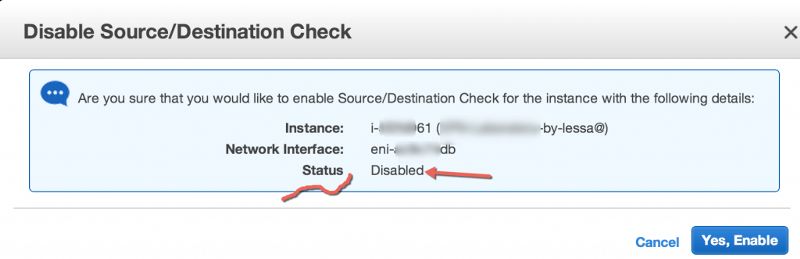

Hey!

Glad you’ve gone this far (or at least jumped straight to the Part II to start configuring OpenSWAN).

One thing I forgot to mention and worth adding in here: There are forks from OpenSWAN that are focused on Authentication ([StrongSWAN](http://www.strongswan.org/)) and one that was just created ([LibreSWAN](https://libreswan.org/)) right after a lawsuit about ownership was gained.

Ok, message given… In this Part II we will be focusing on Configuring OpensWAN, understanding why option A, B, and then jumping to AWS Security Group that is very straight forward, but leaving **AWS Routing Table to** [Part III](http://www.heitorlessa.com/working-with-amazon-aws-vpc-software-based-vpn-part-3/) for some interesting scenarios. IF you are interested in something more specific about Troubleshooting at Part III, please let me know ASAP as I’m still writing some scenarios.

#### Configuring OpenSWAN

Now, let’s configure the main file where all magic happens — **/etc/ipsec.conf.** Please make sure you have changed the settings below before we configure our IPsec proposals:

```
nat_traversal=no_  
#virtual_private=%v4:10.0.0.0/8 
protostack=netkey_
```

Where `nat_traversal=no` is pretty much self-explanatory, `virtual_private` can be commented as we are not using NAT-T and there’s no need to exclude networks here, and finally we are forcing to use `netkey` as our IPsec Stack.

You may have noticed that `ipsec.conf` file has a quite long text under keyword called `conn`, this means that you are creating a new connection (new IPsec connection) with a remote device. On saying that, we will now start configuring our VPN and I will be explaining all the lines thereafter, so please copy/paste the lines below at the end of your `ipsec.conf` and **change the values accordingly to your environment as well.**

```bash
conn AWSVPN                                         # Connection Name  
type=tunnel                                         # Tunnel = IPsec Mode  
authby=secret                                       # Authentication method will be Pre-shared-key, so you need to fill in '/etc/ipsec.secrets' to reflect this 'profile'  
auto=start                                          # Although you can manually start the VPN via command-line, we set Auto pretty much for convenience  
pfs=yes                                             # Perfect Forward Secrecy, it makes sure that Each key generated is Unique after  
ike=aes256-sha1;modp2048                            #Internet Key Exchange (IKE)  aligned to ISAKMP Framework responsible for Phase1 (P1) proposal  
phase2alg=aes256-sha1;modp2048                      # Same as above but Phase 2 Proposal here  
ikelifetime=28800s                                  ## Phase 1 Lifetime  
salifetime=3600s                                    ## Phase 2 Lifetime  
aggrmode=no                                         # Aggressive mode - Disabled, since we want to preserve both peers Identity  
left=%defaultroute                                  # Rather than specifying leftnexthop, this will convert to local IP address and eventually look up to your routing table to go over the Internet. It is commonly used in Dynamic IP scenarios.  
leftid=<Elastic IP associated with OpenSWAN>        # LeftID it's very important, similar to Router-ID, identifies this end of the VPN  
leftsubnet=172.16.0.0/16                            # VPC CIDR/subnet # VPC CIDR where your OpenSWAN is sitting in or your Local Network if this config is in your Side.  
right=<External IP of your router in your office>   # Same as Left but destination IP, which in turn your Router IP  
rightsubnet=192.168.1.0/24                          # Office subnet/network # Same as Left, but destination network
```

> You can also configure this in a separated file for a better organization. Check this [Gist here](https://gist.github.com/winhamwr/2871257) for automation

Although you can split up into small files to each tunnel you may have under `/etc/ipsec.d/`, let’s keep this simple for now.

Therefore, an explanation comes with each parameter using ‘#’, however I would like to reinforce the importance of Left and Right, since there’s so many articles out there creating a misunderstanding about these, that cause so many Threads in Forums over and over again.

You can interpret **Left** and **Right** as if **Source** and **Destination** Network, so if you invert the values you may already know how much trouble you are creating, right?

Ok, ok… Still confused? Let me explain with more details then… These parameters are used to create what we call Security Associations (SA), and in a more generic explanation, it’s all about Encryption, so the following mean:

```bash
_leftsubnet=172.16.0.0/16_  
_rightsubnet=192.168.1.0/24_
```

All packets from `172.16.0.0/16` towards `192.168.1.0/24` **will be encrypted**, and subsequently all packets coming from `192.168.1.0/24` towards `172.16.0.0/16` should be decrypted.

That’s why when you are troubleshooting a ‘No Traffic flows through the tunnel’ issue, **it is important to know if packets are being properly encrypted/decrypted in the right direction**, so you can rule out Security Associations and IPsec problems, and then go to the next level: Firewall, Zone Policies, NAT (if the packet is Translated to another IP — Let’s say Router External IP — it may not be allowed in the Security Associations hence dropped, since your `left=` only allows 172.16.0.0/16 and not 4.3.2.1/32)

Ok, I hope this is now clear and you should never think ‘I have no idea why traffic doesn’t flow’ anymore, since you know how to start troubleshooting it.

Keep going on this config, we need to create a password for our VPN that will be shared/matched between both VPN Peers (named IKE Peers), so make sure you have the Right Syntax as follows (of course, please change the values to reflect yours) under `/etc/ipsec.secrets` file:

```
# Supposedly your Elastic IP is 54.53.52.51, and your Router Public IP is 104.103.102.101  
# Syntax has to be, Left, RightID, ‘ : ‘, PSK and then followed by password
54.53.52.51 104.103.102.101 : PSK “9@!P8*[xmT{b$Atjvh<D?6Xo3:425y”
```

**UPDATE 30th May: order above was wrong, fixed after Oliver (in the comments, tks for that!) spot that. I literally didn’t copy from a working example, and Authentication Method should be defined after ‘:’ in fact.**

In case the order is wrong, Phase 1 will never be completed (most people get mislead seeing PHASE1_COMPLETED, but if you don’t see any Security Associations, this means that there’s still something wrong on Phase 1, since SA’s are created on Phase 1 and then setup on Phase 2), so Tunnel won’t Establish.

Once done, we need to ensure our last two important things: **IP Forwarding and Source/Destination Check**

You may be wondering, well, I thought I would need NAT and not IP Forwarding (believe it, I’ve heard that several times). Well, let me explain again because there’s so much information out there that it can easily confuse someone desperate to find a simple explanation.

Although your VPN establish following everything here, **traffic will traverse both tunnels but it will always stop at both ends (your OpenSWAN in VPC and your Router)**, the good news is that I never seen a router without IP Forwarding enabled, otherwise it wouldn’t make any sense calling it router, but Operating Systems are not Routers, so you **need to enable** this function by making the OS acting as a Router.

**Still confused and so much bla bla bla?**

Ok, keep in mind that your Linux (OpenSWAN) **needs to decrypt the packet that has just arrived**, and **then forward** it to the **final destination** that might be sitting at the same subnet or not. **If IP Forwarding is not enabled**, your Linux/Windows/FreeBSD/OpenBSD whatever OS will basically say: **HEY, I’m not a router dude!** How am I suppose to handle this packet, and forward to Who?

`Can’t take it….dropping, sir!!`

In most scenarios, IP Forwarding is enough and it does the trick, however as you are ‘in the Cloud’ there’s always something else to double-check, and **in AWS wouldn’t be different since there’s a protection called ‘Source/Destination check’**, which basically invalidates IP Forwarding as well, since it looks at the IP Header and confirm if the Source/Destination are the same, but as your OpenSWAN will be forwarding the packet to another instance, this will drop the packet and you will never see it by running a Packet Capture.

So, to resolve IP Forwarding and other ‘inconveniences’ like ICMP Redirect, you can do the following to instruct your Linux to act as a Router:

```bash
# cat <<-EOF >> /etc/sysctl.conf  
# Disable Source verification and send redirects to avoid Bogus traffic within OpenSWAN  
net.ipv4.conf.all.rp_filter=0  
net.ipv4.conf.default.rp_filter=0  
net.ipv4.conf.eth0.rp_filter=0  
net.ipv4.conf.lo.rp_filter=0  
net.ipv4.conf.all.send_redirects=0  
net.ipv4.conf.default.send_redirects=0  
net.ipv4.conf.eth0.send_redirects=0  
net.ipv4.conf.lo.send_redirects=0  
net.ipv4.conf.all.accept_redirects=0  
net.ipv4.conf.default.accept_redirects=0  
net.ipv4.conf.eth0.accept_redirects=0  
net.ipv4.conf.lo.accept_redirects=0  
# Enable IP forwarding in order to route traffic through the instances  
net.ipv4.ip_forward=1  
EOF
```

Now, to **disable Source/Destination Check**, do a right-click on your instance on EC2 Console, and then click on Source/Destination check, and then 'Yes, Disable' - Simple as that. So always remember it, **if you already checked everything else and destination is still unreachable in EC2/VPC, double check Source/Destination check.**



> Show time!

Finally! Connect to your instance, and then restart OpenSWAN service as follows to bring this tunnel UP: `/etc/init.d/ipsec restart`

Now, run the following command to confirm if everything went just fine or if there's any error in your VPN Settings: `ipsec auto --status | tail -n 20`

If everything went OK, you Should see the line below:

```bash
000 #1: "AWSVPN":500 **STATE_MAIN_I4 (ISAKMP SA established)**; EVENT_SA_REPLACE in 27628s; newest ISAKMP; lastdpd=3s(seq in:13153 out:0); idle; import:admin initiate
```

If it didn't show this message, no worries, at least we have something to talk in the [Part III](http://www.heitorlessa.com/working-with-amazon-aws-vpc-software-based-vpn-part-3/) and discuss what went wrong here, so you can use the knowledge to work on any IPsec in any Device (At least have a good starting point where to go to).

**See you in the next** [Part III](http://www.heitorlessa.com/working-with-amazon-aws-vpc-software-based-vpn-part-3/), soon!