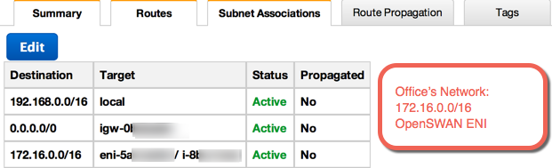

Welcome back !!

Let’s finally finish this series and maybe blow your mind with possible scenarios that may happen while you are **Troubleshooting, so take a good cup of tea/coffee, and enjoy the reading.**

If you happened to see this article first, please make sure you read Part I and Part II, otherwise you may get lost here.

* [Working with Amazon AWS VPC: Software-based VPN Part 1](https://blog.heitorlessa.com/working-with-amazon-aws-vpc-software-based-vpn-part-1-f540a70c60ab)
* [Working with Amazon AWS VPC: Software-based VPN Part 2](https://blog.heitorlessa.com/working-with-amazon-aws-vpc-software-based-vpn-part-2-ee39329a8f17)

**Issue: Establishing the tunnel**

In case you didn’t open the Firewall port (**UDP 500**) and Protocol (**ESP — 50**), you won’t be able to even pass the **Phase 1.** Explaining in a simplistic way, the following happens:

* A traffic must be **sent towards the destination** (the other side of the VPN), and if this ‘destination’ where you sent the traffic matches what you have configured on your VPN Settings, this initiates the IPsec Negotiation. **This is classified as ‘interesting traffic’.**
* Then, IPsec **Negotiates its current settings with its IKE Peer** (the other guy on the other side of this VPN — Your router), and if everything is correct, then the Phase 1 is established, and it creates the Security Associations
* Once Phase 1 is established and tunnel, you then go to **Phase 2 which sets up the Security Associations** (SPD, SPI), which in turn changes **Tunnel Status to UP** once complete

> **In fairness, if you firewall blocks ESP packets and IKE, your IPsec negotiation will never happen.**

Please check articles below if you want to learn all details about this process.

* [How IPSec Works > IPSec Overview Part Four: Internet Key Exchange (IKE)](http://www.ciscopress.com/articles/article.asp?p=25474&seqNum=7)
* [Understanding IKE and IPsec Packet Processing - JUNOS Software Security Configuration Guide](http://www.juniper.net/techpubs/software/junos-security/junos-security10.0/junos-security-swconfig-security/ipsec-packet-processing-overview.html)

See below the output of this same VPN when I remove Security Group rules that allow IPsec to negotiate:

```bash
# ipsec auto --status | tail -n2  
000 #1: "AWSVPN":500 STATEMAINI1 (sent MI1, expecting MR1); EVENTRETRANSMIT in 8s; nodpd; idle; import:admin initiate  
000 #1: pending Phase 2 for "AWSVPN" replacing #0
```

As you can see above, it sends the message (sent MI1) to start negotiating but never receives anything back (expecting MR1).

If I add it back as follows, **but I have a mismatch** between both IKE Peers (let’s say that the Encryption algorithm is set to AES-128 instead of 256 on both peers):


Mismatch example:

**OpenSWAN on AWS side**

```bash
000 stats dbdops: {currdcnt, totaldcnt, maxsz} :context={0,0,0} trans={0,0,0} attrs={0,0,0} 000d
```

**OpenSWAN on Office side**

```bash
000 #1: “AWSVPN”:500 STATE MAIN I1 (sent MI1, expecting MR1); EVENT RETRANSMIT in 2s; nodpd; idle; import:admin initiate  
000 #1: pending Phase 2 for “AWSVPN” replacing #0d
```

Pretty much the same as before, but one side doesn’t even try to negotiate and it only shows ‘000’.

But one thing that it is really easy to get confused and leads to an extensive troubleshooting until you find that the reason why a VPN is flapping is **Lifetime**:

```bash
000 #4: “AWSVPN”:500 STATE QUICK R2 (IPsec SA established); EVENT SA REPLACE in 3288s; newest IPSEC; eroute owner; isakmpd  
d#3; idle; import:not setd   
000 #4: “AWSVPN” esp.790e7820@54.53.52.51 esp.7ed4e3bd@192.168.1.7 tun.0@54.79.1.203 tun.0@192.168.1.7 ref=0 refhim=4294901761d   
000 #3: “AWSVPN”:500 STATE MAIN R3 (sent MR3, ISAKMP SA established); EVENT SA EXPIRE in 246s; lastdpd=42s(seq in:11910 out:0); idle; import:not setd   
000 #5: “AWSVPN”:500 STATE MAIN I4 (ISAKMP SA established); EVENT SA EXPIRE in 265s; lastdpd=2s(seq in:16999 out:0); idle; import:not set 000  
#6: “AWSVPN”:500 STATE MAIN R3 (sent MR3, ISAKMP SA established); EVENT SA REPLACE in 14s; newest ISAKMP; lastdpd=2s(seq in:22693 out:0); idle; import:not setd

ipsec auto — status
```

As you notice above, I have just started my VPN but I already got an **EVENT SA EXPIRE in 265s**, which it shouldn’t happen, since the **Phase 1 Lifetime** should be configured to **8 hours**.

**Issue: Encryption/Decryption — No traffic flows**

Let’s say that your IPsec Tunnel has just established, and you can see that **traffic is not flowing correctly**, so you want to find out what’s going on here since **you’ve already checked your Firewall Policies and Routing and nothing appears to be the problem**.

This is a very common issue that happens when you start working with 3rd-party devices where Security Associations might not be that visible to the Administrator, so let’s first show what you should always check when the tunnel is Established:

```bash
# ipsec auto — status | grep ‘===’
```

```bash
000 “AWSVPN”: 192.168.0.0/16===192.168.1.7[54.53.52.51 ,+S=C] 104.103.102.101<104.103.102.101>[+S=C]===172.16.0.0/16; derouted; eroute owner: #2
```

Remember when I said the importance of ‘Left’ and ‘Right’ — There we go!

Here it exemplifies **Encryption/Decryption** — The main function of **Security Associations** which encrypts/authenticates the flow in one-direction, that’s why then a **Pair of Security Associations (inbound/outbound)** — so if you read from left-to-right you should get the information below:

* **192.168.0.0/16**— Source Network where all packets should be decrypted when arrived
* **192.168.1.7** — Private IP of this OpenSWAN
* **54.53.52.51** — Public IP of this OpenSWAN (The famous **LeftID** I hardly insisted)
* **104.103.102.101** — Public IP of the other destination (The famous **Right)**
* **172.16.0.0/16** — Destination Network where all packets sent should be encrypted

### **Summary**

* **1x Security Association to control all traffic flow from 192.168.0.0/16 towards 172.16.0.0/16** which it will encrypt all traffic
* **1x Security Association to control all traffic flow from 172.16.0.0/16 towards 192.168.0.0/16** which it will decrypt all traffic

**Ahh that’s easy, right? Nope??????**

Ok, as we usually learn in the hardest way, I will give you a tip (but don’t EVER do this in a production environment) or else you can mess up your environment. Change the Destination Network (`rightsubnet`) to a particular IP (let’s say 8.8.8.8) or if you are crazy enough, set to 0.0.0.0.

> Before you apply these changes, make sure OpenSWAN won’t start after you reboot

Once you do that, and apply changes, you will notice that all traffic to that particular IP it will now become unreachable, but if you **set to 0.0.0.0** you will simply **lose your connectivity** to OpenSWAN.

This happens because IPsec was **instructed to Encrypt ALL packets to that particular destination OR to everyone**, but if the other side doesn’t decrypt (he may doesn’t have IPsec enabled there or his Security Association is different than yours, or even simpler, you don’t have an IPsec tunnel with them) the traffic that you sent, **this basically means that the packet will be dropped!!**

**I think you learned now ;)**

For a final word about this, let’s see how it looks like a **Security Association** while working with **OpenSWAN**:

```bash
# ip xfrm state

src 54.79.1.203 dst 192.168.1.7
  proto esp spi 0x21849f60d dreqid 16385 mode tunnel
 dreplay-window 32 flag af-unspec
  dauth-trunc hmac(sha1) d0x254ceda669aef0a576ab5ff450f2fb00eaf39bba 96
  denc cbc(aes)d d0x6ac6d6fc2b3e28c8257e7f91d64ab5f073ab6764d1bea74f88f1a13ae50d250b

dsrc 192.168.1.7 dst 54.79.1.203  
  proto esp spi 0xbeaabd09d dreqid 16385 mode tunnel
 dreplay-window 32 flag af-unspec  
  auth-trunc hmac(sha1) 0x443010fdb7a89454ce86e637e93d7183f0ca7630 96  
  enc cbc(aes) 0x709d650f57371148c0e4d1eaba43605378f38ef902c348312d1c97727a93da9c
```

A bit more details about the **traffic flow:**

```bash
# ip xfrm policy

src 192.168.0.0/16 dst 172.16.0.0/16  
dir out priority 2608 ptype main  
 tmpl src 192.168.1.7 dst 54.79.1.203  
 proto esp reqid 16385 mode tunnel

src 172.16.0.0/16 dst 192.168.0.0/16  
dir fwd priority 2608 ptype main  
 tmpl src 54.79.1.203 dst 192.168.1.7  
 proto esp reqid 16385 mode tunnel

src 172.16.0.0/16 dst 192.168.0.0/16  
dir in priority 2608 ptype main  
 tmpl src 54.79.1.203 dst 192.168.1.7  
 proto esp reqid 16385 mode tunnel
```

If you believe that there’s a problem here in the Encryption/Decryption, you can run the command below to monitor packets in real time being encrypted/decrypted in both directions, in case you see that, but still having problems with Traffic flow, it’s certainly not a Firewall rule or Security Associations issue:

**Open up 2 SSH sessions on your OpenSWAN, one you run ‘ip xfrm monitor’ while the other you send a ping towards your destination, you should see the following IF everything is alright:**

```bash
# ip xfrm monitor

Async event (0x20) timer expired  
  src 192.168.1.7 dst 104.103.102.101 reqid 0x4001 protocol esp SPI 0x11de94e9 <<- Encrypting traffic

Async event (0x20) timer expired  
  src 104.103.102.101 dst 192.168.1.7 reqid 0x4001 protocol esp SPI 0x9c35808a <<- Decrypting traffic

```

Similar to a sniffer, you can see **traffic in both directions and its SPI (Security Policy Index)**, if you don’t see this, you may need to investigate your Security Associations first, since this will block at **Layer 3 (IP).**

If you want more information about IPsec on Linux — Check [this out](http://www.linuxfoundation.org/collaborate/workgroups/networking/ipsec-overview)

**Issue: Firewall — No traffic flow**

Depending on the device you have, you may have two things to look into: **Firewall Policy, Zone Policy**. In our case, we will have **AWS Security Group + Firewall at instance-level (iptables).**

**Supposing you already checked IPsec Security Associations above already**, it is relatively easy to find out if the Firewall is the problem, it’s pretty quick. Try to create a **new rule allowing ALL ICMP traffic** to Everywhere (don’t Ever Ever Do this in production), and then you run the same command in your Security Associations to see if packets are being encrypted/decrypted correctly:

```bash
# ip xfrm monitor

# AWS Side

Async event (0x20) timer expired

src 192.168.1.7 dst 104.103.102.101 reqid 0x4001 protocol esp SPI 0x11de94e9 <<- Encrypting traffic

<No packets being decrypted… no Response>

# OpenSWAN on Office side

Async event (0x20) timer expired

src 54.53.52.51 dst 172.16.20.59 reqid 0x4001 protocol esp SPI 0x11de94e9 <<- Decrypting traffic

<No packets being encrypted…no Response Sent>
```

Hmmmm! It looks like we’ve made some progress here…

Since packets are being encrypted/decrypted in the right direction, but you can’t get a response from the other side, this might be either a Routing Issue (keep reading, I know.. too much text =/) or Firewall/NAT, let’s find out them.

Enable Logging on your firewall (in our case, we need to log all packets in PREROUTING since I created a rule to block under INPUT chain, **even though** **Security Groups is indeed allowing traffic between both networks**):

```bash
# iptables -A INPUT -p icmp -j DROP  
# iptables -t nat -A PREROUTING -p icmp -j LOG — log-prefix “ICMP packet Arrived: “  
# iptables -t nat -A POSTROUTING -p icmp -j LOG — log-prefix “ICMP packet Leaving: “
Jun 5 17:45:03 ip-172–16–20–59 kernel: [16479014.361404] ICMP packet Arrived: IN=eth0 OUT= MAC=06:cc:8d:48:58:d6:06:2c:96:cf:d3:21:08:00 SRC=192.168.1.7 DST=172.16.20.59 LEN=84 TOS=0x00 PREC=0x00 TTL=64 ID=53765 DF PROTO=ICMP TYPE=8 CODE=0 ID=12819 SEQ=8
```

As we cannot see any **packets leaving** message, this wouldn’t be caused by a NAT rule, so if you create an ALLOW ALL ICMP and you see your response, there we go ;) Firewall Rules (But don’t forget about your Zone Policies, Juniper for example) was the issue!!

There are scenarios where things can get darker when there’s a combined issue with Firewall Policies, Zone Policies and Packet inspection, so get to know your device first and how Traffic flows there.

**Issue: NAT — Traffic flows from one way but not other**

In my humble opinion, I think this is the **trickiest one**, since it takes a lot of time to check for everything else, when sometimes you forgot **you had a NAT Outbound/Masquerade** rule there, which basically causes the following:

* You can see packets being encrypted (check Security Associations above if this is new for you)
* You can see packets being decrypted on the destination
* You are seeing that Firewall didn’t block anything
* You triple check Routing and it looks OK from/to both Networks (Private IPs)

On knowing that, you run a few more tests and discover the following

* You don’t see any Packets being encrypted on your side (**Security associations + NAT problem**)
* You don’t see any Packets leaving your Machine (**NAT + Routing problem**)

Therefore, to easily spot an issue with the first scenario where NAT is translating your Private address into External one, and then being blocked by Security Associations, since your Source Network was only allowing the private network.

To easily see if packets are indeed being translated and being lost on the way back, you can allow 0.0.0.0 in your Security Association, so it will encrypt/decrypt any traffic (of course this is not recommended, but there are certain scenarios that this is required (Limitation of number of Security Associations for example, etc), and then once you’ve done that (change your Source Network, for instance).. let’s see how the packet is arriving:

```bash
# tcpdump -n icmp

18:25:10.497798 IP **54.53.52.51** > 172.16.20.59: ICMP echo request, id 16411, seq 1, length 64
```

Ahaa! Then, when your machine tries to respond to this ICMP, he thinks:

* Hmmm.. there’s no entry in the Routing Table
* Ok.. let’s forward it to our default Gateway (`0.0.0.0/0`).. he knows what to do!

On the other hand.. you are there, waiting to your beloved packet.. and Hey.. **your packet has just being routed back over the Internet** instead of going back over the tunnel. So here’s the thing to solve:

* Don’t use NAT! Unless there’s a real need for that…
* If you can’t make changes on your router to stop doing NAT, you can create a temporarily Static Route pointing to your External IP towards the Tunnel

When I say it’s tricky, you will experience scenarios where Traceroutes (OK, it’s a matter of understanding [how to interpret Traceroute/Tracert results](https://www.nanog.org/meetings/nanog45/presentations/Sunday/RAStracerouteN45.pdf)) results show that it “stopped” in determined Hop which by coincidence is One Hop before your destination (Everything else is * * * *).

Then you go — Ahaa! The problem is in that router, all packets are stopping there! — Hmmm, silly mistake here (that’s normal btw).

When you see that the last Hop stopped in position 9 for example, and your destination was number 10, that doesn’t mean that the problem was in the Hop (let’s say Router here) 9, but **instead, the packet was forwarded to number 10 through the Router but didn’t get a response back (round-trip)**.

**Issue: Routing**

Since Routing (I mean Static Routing here, not External protocols like BGP, OSPF, RIP, etc) for this scenario is deadly simple, I won’t focus on so much.

In 90% of the cases you get problems in AWS while routing packets (even though you have the correct route) will more likely to be Source/Destination check — Explained in [Part II ](http://www.heitorlessa.com/working-with-amazon-aws-vpc-software-based-vpn-part-2/).

Regardless this, it’s just a matter of configuring a Static Route pointing to your instance as Target:



Easy enough, right?

If you are still in doubt about a Routing Issue or not, quickly run a Traceroute/Tracert so you can confirm that ;)

**This should give a little insight of why sometimes VPN can be tricky to troubleshoot, and I’m not even mentioning Performance issues, otherwise it would take another article, but this should give a good start for you to troubleshoot not only IPsec in Linux but also other devices, OSes, etc.**

Either way, I truly hope it helps a bit, but you will realize that this is a not a single-shop-stop learning, but can be used as a ‘Huge CheatSheet’, so you can dive deeper into one or multiple issues later on :)